# 1. Beamline Introduction

    https://youtu.be/GTfGjObx2ww

Optical Layout

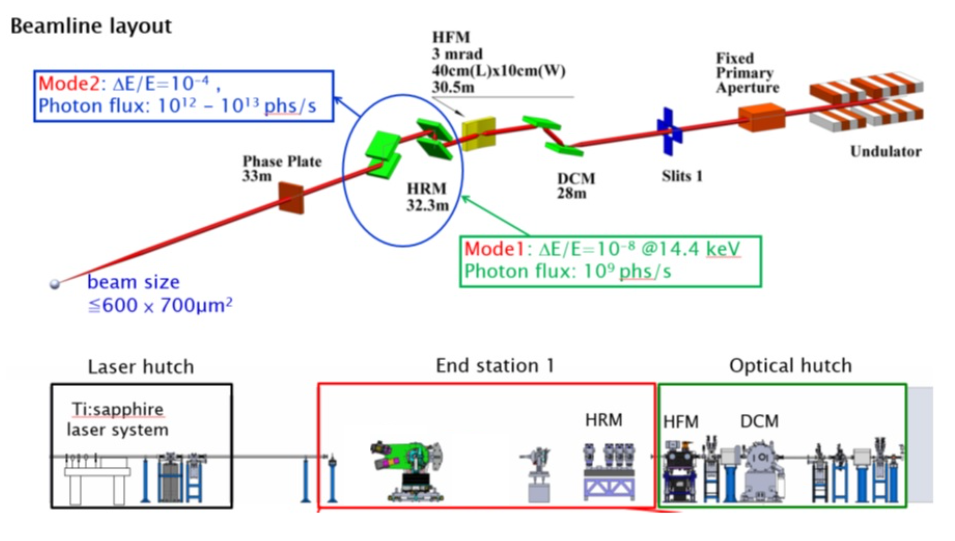

Specification

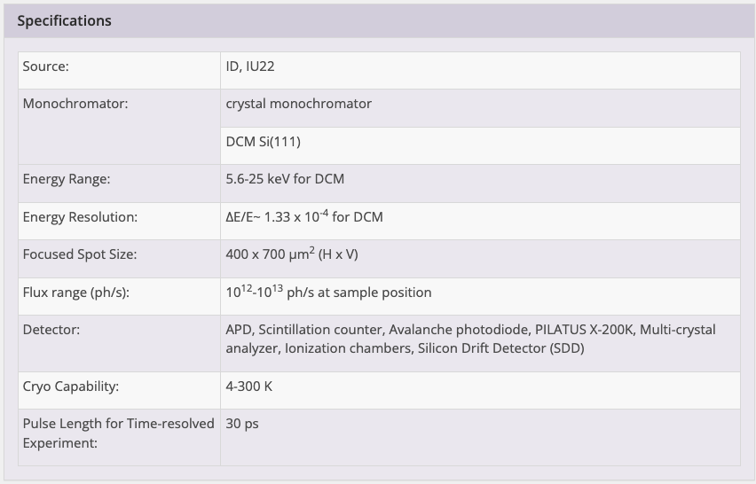

## 1.1. X-ray Source : Undulator

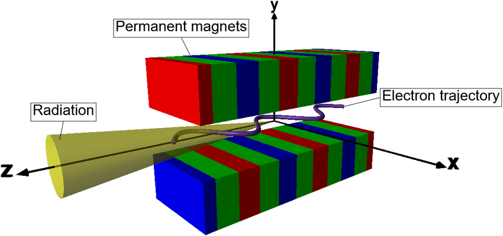

## 1.2. Double Crystal Monochromator (DCM) 

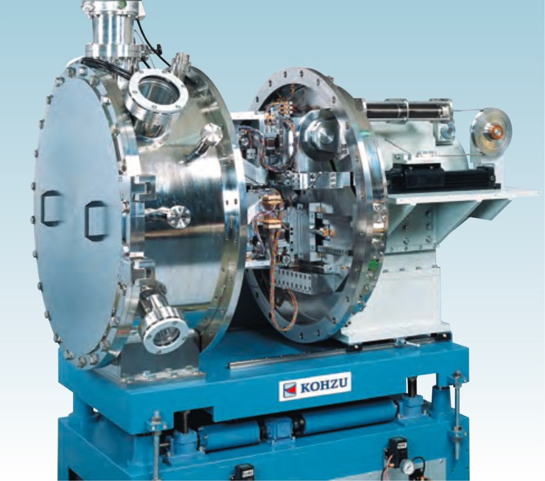

reference : `https://www.kohzuprecision.com`

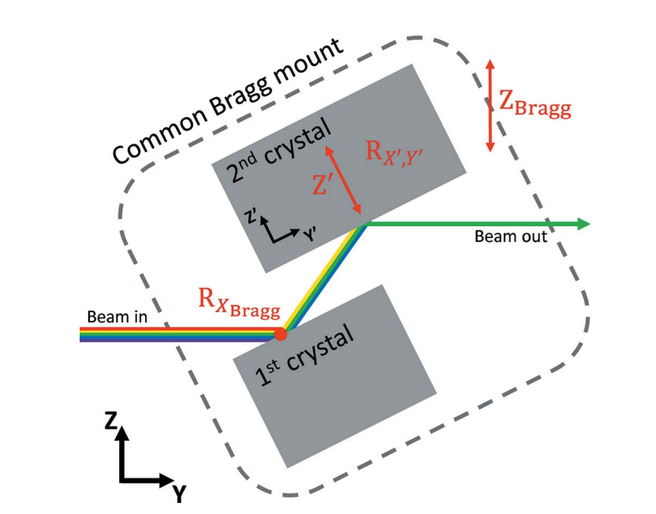

reference : `https://core.ac.uk/download/pdf/193744428.pdf`

## 1.3. Horizontal Focusing Mirror (HFM)

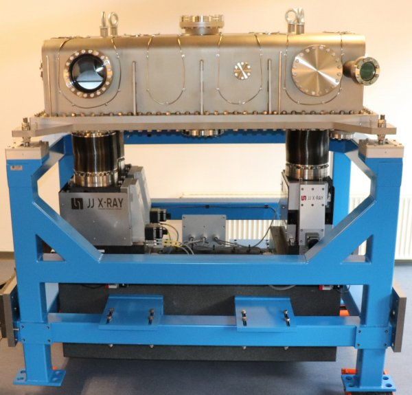

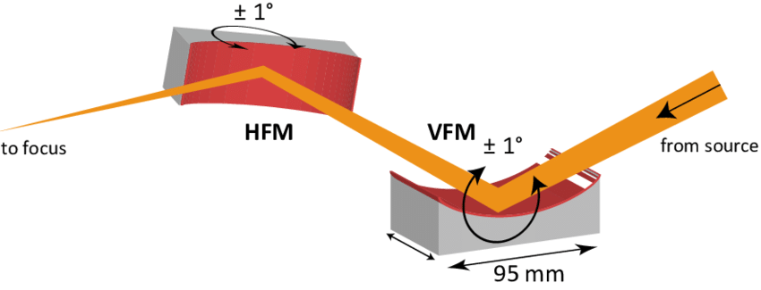

## 1.4. High Resolution Monochromator (HRM)

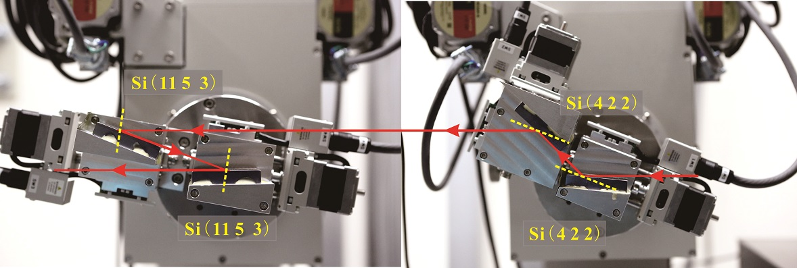

## 1.5. Diffractometer System

 

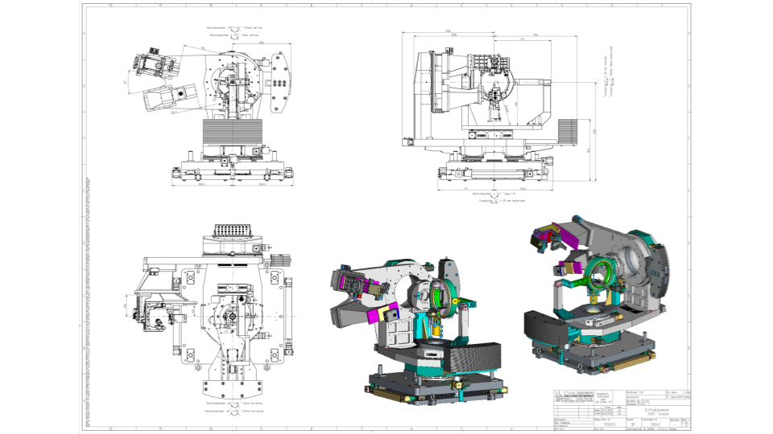

## 1.6. Detector 

### Ion Chamber 

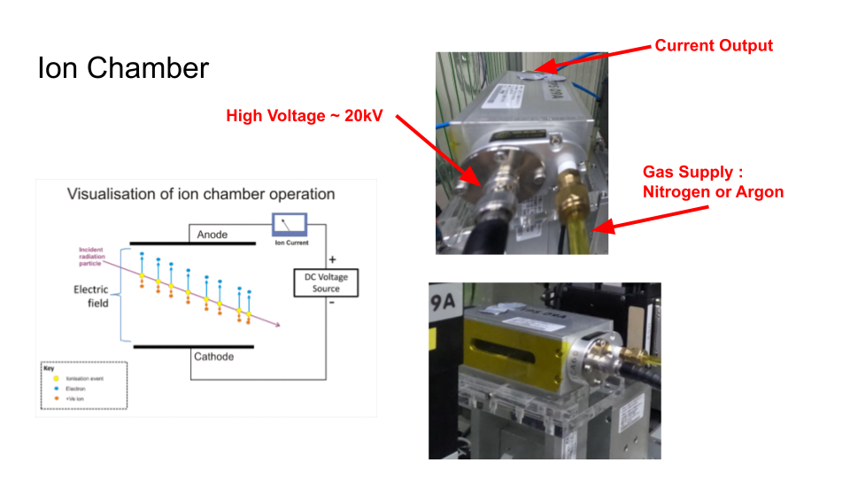

### Scintillator counter (C400)

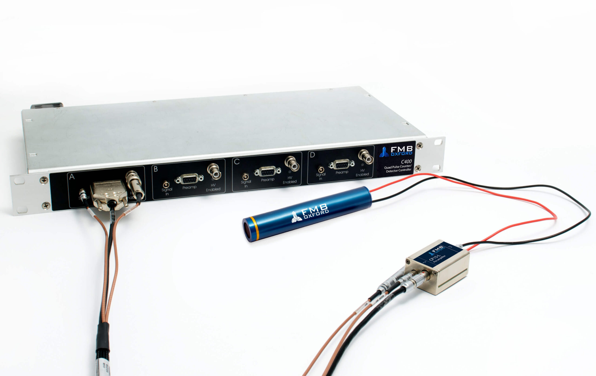 

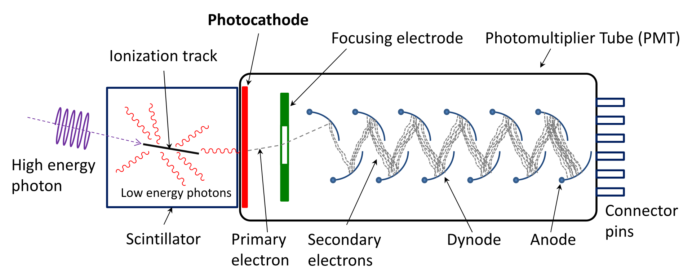

### Area Detector (EIGER)

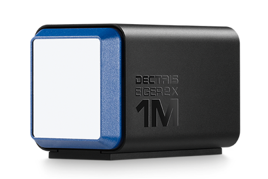 
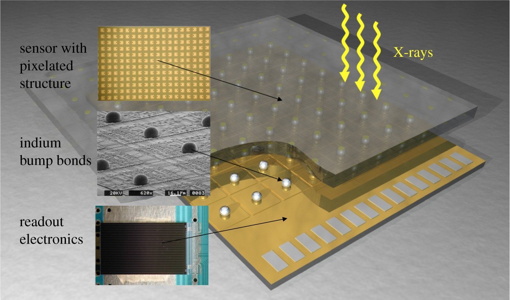
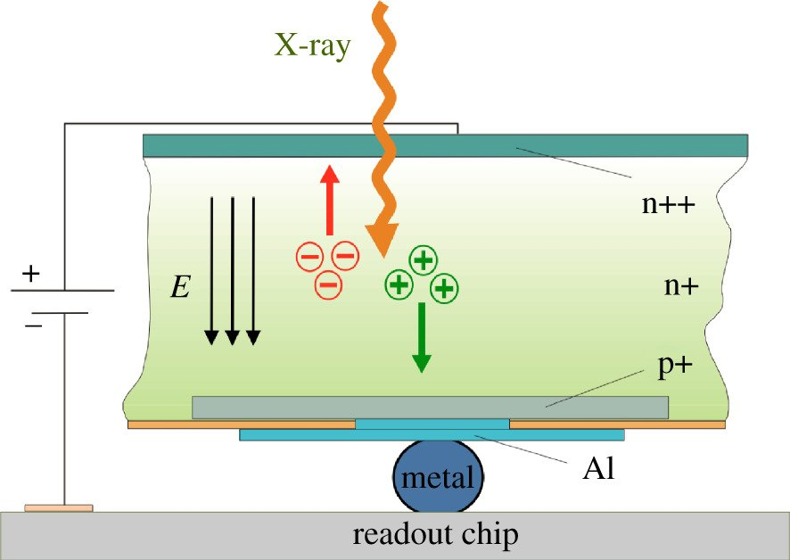

### Avalanche Photodiode (APD)

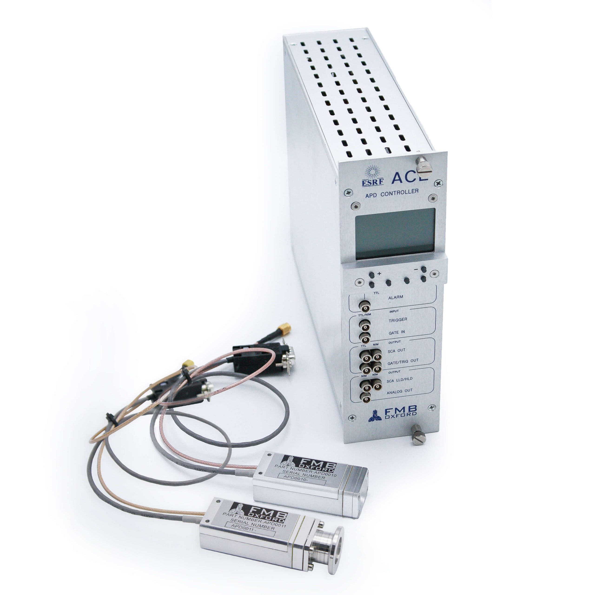 
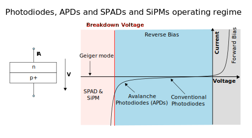

## Slits

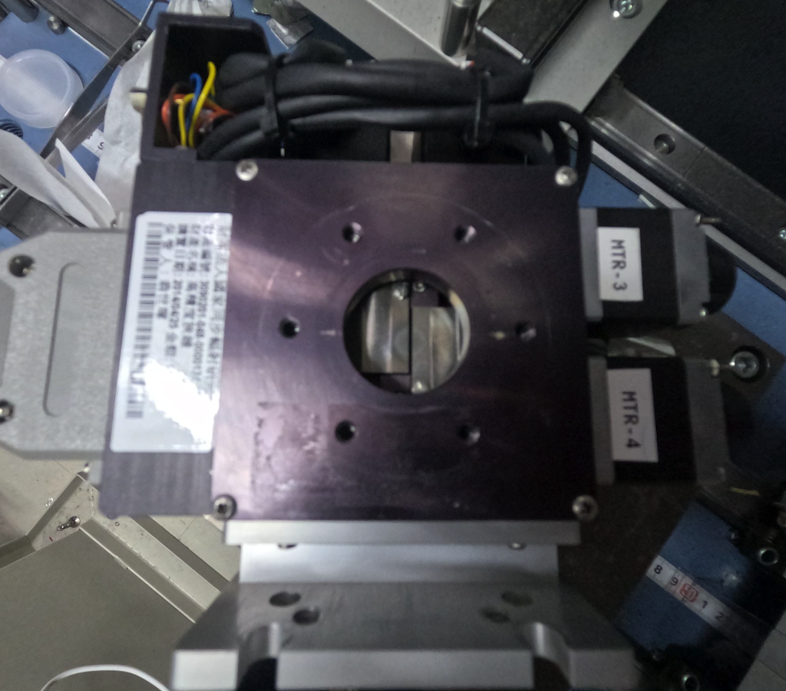

## 1.7. Varing Sample Temperature

### Cryostat

### DCS500

