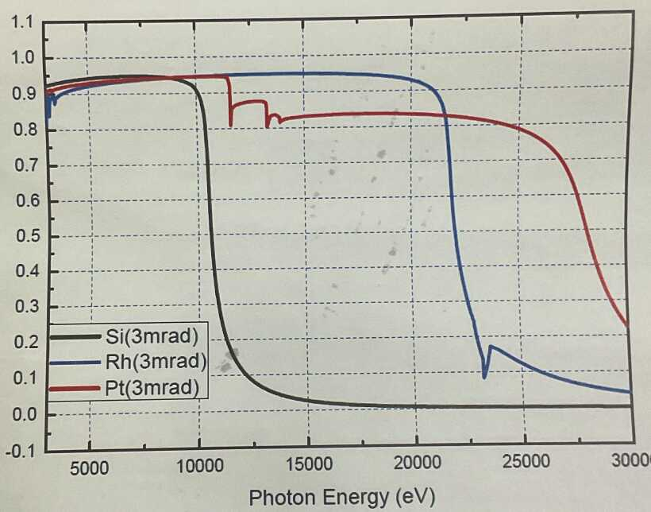

# 1. Beamline Introduction

    https://youtu.be/GTfGjObx2ww

Optical Layout

Specification

## 1.1. X-ray Source : Undulator

Undulator 是一種產生 X-ray 的裝置，其原理是在一條直線上排列一系列的磁鐵，產生一個磁場，當電子束通過磁場時，會受到 Lorentz force 的作用，使電子束產生震盪，產生 X-ray。

透過調整磁場的強度，可以改變 X-ray 的波長。下圖為固定某一個磁場強度時，產生的 X-ray 能量分佈。

## 1.2. Double Crystal Monochromator (DCM) 

Undulator 產生的 X-ray 是一個寬頻的光源，需要使用 Double Crystal Monochromator (DCM) 將特定波長的 X-ray 過濾出來。

DCM 由兩片單晶體組成，第一片稱為入射晶體，第二片稱為出射晶體。藉由調整晶體的角度(繞射角)可以選擇特定波長的 X-ray。

Undulator 出來的光強度非常強，因此 DCM 會受到很大的熱負荷，所以會使用液態氮冷卻系統來將 DCM 的晶體冷卻固定在特定溫度。
如果 DCM 的晶體溫度不穩定，會導致 X-ray 的波長不穩定，影響實驗結果。

reference : `https://www.kohzuprecision.com`

reference : `https://core.ac.uk/download/pdf/193744428.pdf`

## 1.3. Horizontal Focusing Mirror (HFM)

在光通過 DCM 之後，會經過水平聚焦鏡 (HFM) 進行聚焦。

HFM 是一個曲面鏡，上面會使用特定材料進行鍍膜。該鍍膜會將特定波長的 X-ray 反射出來，並讓其較高波長的 X-ray 通過。
TPS09A 使用的 HFM 鍍膜有三種不同的材料: `Rh`, `Si`, `Pt` ，可以互相切換以支援不同波長的 X-ray。其 X-ray 的能量分佈如下圖所示。

## 1.4. High Resolution Monochromator (HRM) (特定實驗使用)

HRM 是一個高解析度的單晶體，用來進一步過濾出特定波長的 X-ray。HRM 的原理和 DCM 類似，但是 HRM 的解析度更高，可以選擇更窄的波長。

TPS09A 使用的 HRM 使用四塊 Si 晶體組成，其使光路與使用的繞射角度如下圖所示。

HRM 對溫度的穩定性要求非常高，如果 HRM 的溫度不穩定，會導致 X-ray 的波長不穩定，影響實驗結果。

## 1.5. Diffractometer System

TPS09A 使用 Huber X 繞射儀系統。該系統為一個六軸的繞射儀，並在 detector 前方裝有一組小型的繞射環可以作為 Analyzer 使用。

 

## 1.6. Detector 

### Ion Chamber 

Ion Chamber 是一種用來測量 X-ray 強度的探測器。其原理是當 X-ray 通過探測器時，探測器內的氣體會被電離，產生一些自由
電子，這些電子會被探測器內的電場吸引，產生一個範圍在 nA ~ uA 的電流。該電流的大小與 X-ray 的強度成正比。

該微弱電流會電流計 (Keithley 6400 series) 讀取並轉換類比電壓訊號，再由轉換器將其轉為數位訊號後引入計數器(Counter)。

TPS09A 使用氮氣或氬氣作為探測器內的氣體，其氣壓約為 1 atm。Ion Chamber 一般用於觀測 X-ray 的強度變化，並不適用於高解析度的實驗。

### Scintillator counter (C400)

閃爍計數器原理是當閃爍晶體被 X-ray 照射到會被激發產生一些光子，這些光子會被光電倍增管 (PMT) 接收後經過訊號轉換電路。

因為其高靈敏度和高解析度，因此TPS09A 主要使用閃爍計數器作為繞射訊號的 detector。

使用閃爍計數器時，需要注意 X-ray 訊號的強度，因為過強的光源會導致閃爍晶體過飽和甚至**損壞**。 

 

### Area Detector (EIGER)

TPS09A 使用 DECTRIS EIGER2 作為二維探測器。其量測結果會以二維影像的形式顯示在電腦螢幕上並儲存起來。

因為每次量測的數據量非常大，並且以 TIFF 影像檔形式或是 HDF5 檔案格式儲存。在處理這些數據時所需要的記憶體、硬碟空間以及程式設計的能力都有機會成為門檻...

 

### Avalanche Photodiode (APD)

APD (雪崩光電二極體) 是一種半導體光電 PIN 二極體，加上一個反向偏壓將其操作在雪崩電壓的範圍內。
當光子照射時，會產生電子電洞對，這些電子會被電場加速，並在晶體內產生雪崩效應產生電流訊號。

其對於光強度具有高靈敏度和高時間解析速度，因此常用於時間解析的繞射實驗之中。

 

## Slits

TPS09A 使用了如下圖的 slit 系統。該 slit 系統由上、下、左、右四個由步進馬達控制的金屬刀片組成。

在樣品的上遊沿線設置了兩組 slit 用來量測光束的大小和方向。

在 detector 的上遊沿線亦設置了兩組 slit ，主要用來過濾掉不需要的散射光。

## 1.7. 樣品變溫系統

當需要進行溫度控制的實驗時，可以使用樣品變溫系統。TPS09A 提供了兩樣品變溫系統，分別是 Cryostat 和 DCS500。

進行變溫實驗時，需要先將樣品裝置 mount 在樣品變溫系統上，再將樣品變溫系統安裝在 X 繞射儀上。

### Cryostat

- 溫度範圍： 10K ~ 300K

樣品需用銀膠黏貼在銅制 holder 上，再將 holder 裝在 Cryostat 上。降溫之需先安裝鈹製 Chamber ，再抽真空。 

因為 Cryostat 的機械結構問題，`phi` 軸角度的可動角度會被限制在約 100˚ 內，因此在安裝樣品時，需特別注意樣品的位置。

因為使用 He 氣壓縮機冷卻系統會接上氣體管路並且接上馬達控制線路，因此在移動馬達的時候要特別小心各種東西卡住的相關問題。

### DCS500

- 溫度範圍： -180˚C ~ 500˚C

樣品需如下圖一樣用類似迴紋針的機構夾在 DCS500 本體上。
如果樣品太小，夾不住的話，需要先將樣品用銀膠黏在一片**導熱性良好**的 holder 上，再用迴紋針夾在 DCS500 上。

樣品在升降溫之前，需安裝碳製保護罩，以避免樣品受到環境的影響。因些如果樣品太大，無法裝在保護罩內的話，則無法使用 DCS500 進行變溫實驗。

# In-House XRD System

In-house XRD 系統位於研光大樓 L107 實驗室。該實驗室有門禁需申請才能刷過。用戶需經過上機考核通過後才能申請使用。

In-house XRD 使用 RigaKu 系統作為光源，使用 `Cu Kα 1.54056 Å`。用戶需會自行操作，開關機、升降電壓電流。下圖為操作面板。

X-ray 出光口處會經過一個 Ge 晶體進行濾波。下圖為放置 Ge 晶體的容器。

下圖為 4C 繞射儀。

in-house XRD 使用不同片數的銅箔組合作為衰減片，以達到不同的衰減倍率。

