# Operation System

這裡的 "Operation System" 指的是實驗室中的操作系統，包含電腦操作系統、儀器操作系統、EPICS 等。

電腦的操作系統是指電腦的作業系統，例如 Windows、Linux、MacOS 等。生活中常見是 Windows 作業系統，而 Linux 是一個開源的作業系統，有許多不同的版本，例如 Ubuntu、CentOS、Debian 等。TPS09A 目前使用的是 Rocky Linux 8.4，這是一個由 CentOS 8 衍生出來的版本。

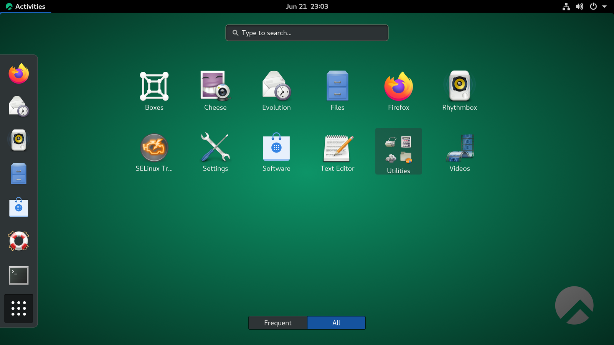

儀器的操作系統是指儀器的控制系統，例如 CSS SPEC FourC。

EPICS（實驗物理與工業控制系統）是一種軟體框架系統，被設計用來整合管理科學儀器，被很多粒子加速器和其他大型科學實驗設施用來進行系統整合。該系統包括了構建、控制系統的工具以及ㄧ套名為 Channel Access (CA) 的網路通訊協定。在同步輻射設施中，EPICS 用於控制光束線、管理能量水平和監控傳感器，確保加速器安全、高效、可靠運行。

## Computer Operation System

Linux : Rocky Linux 8.4

## windows key 

重要技巧，使用 Windows 鍵盤快捷鍵可以讓你在同時開啟的多個視窗中快速找到並切換到你要的視窗。

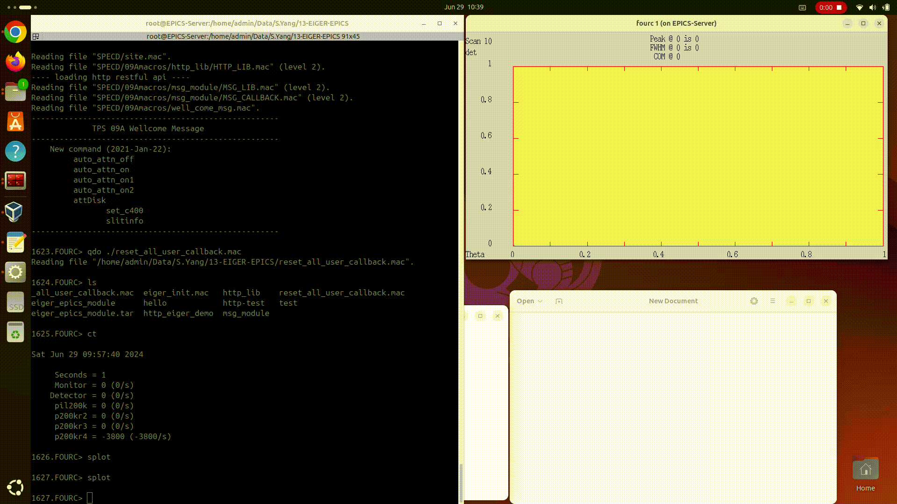

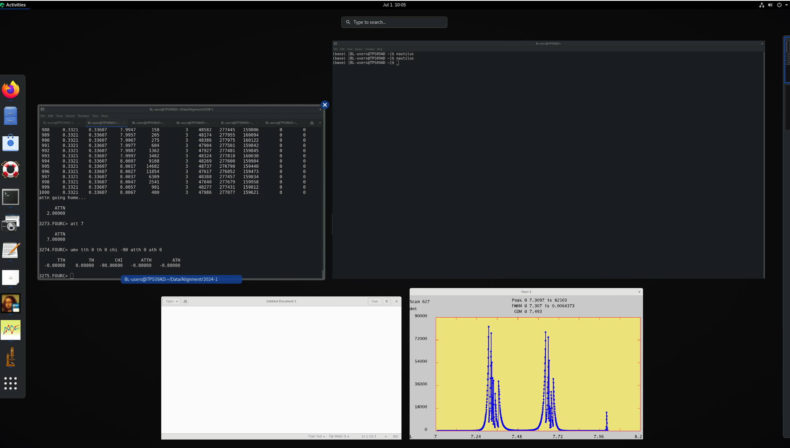

## Start Menu

點擊左下角的 Start Menu 按鈕，可以打開 Start Menu 選單，可以用來開啟文字編輯器或 File Manager 等應用程式。

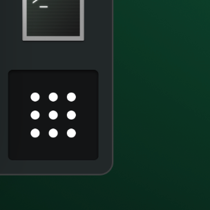

### 檔案系統

目前所有的用戶都共用同一個 User ID

    BL-users

並共用同一個 Home Directory

    /home/BL-users/

但是每個實驗室都有自己的目錄，例如：

    /home/BL-users/Data/<Your Lab Directory>

不同的實驗室有不同的目錄，請確認你的實驗室目錄。並且請不要動到別人的目錄內容。

### Terminal Emulator

繞射儀操作系統需在文字指令介面(Command Line Interface) 的環境下執行，需要使用 Terminal Emulator 來執行 `fourc`。

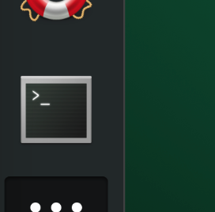

### 檔案管理員

檔案管理員是一個用來管理檔案的程式，可以用來新增、刪除、複製、移動檔案。等同於 Windows 的 "檔案總管"。

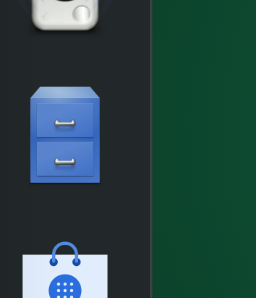 

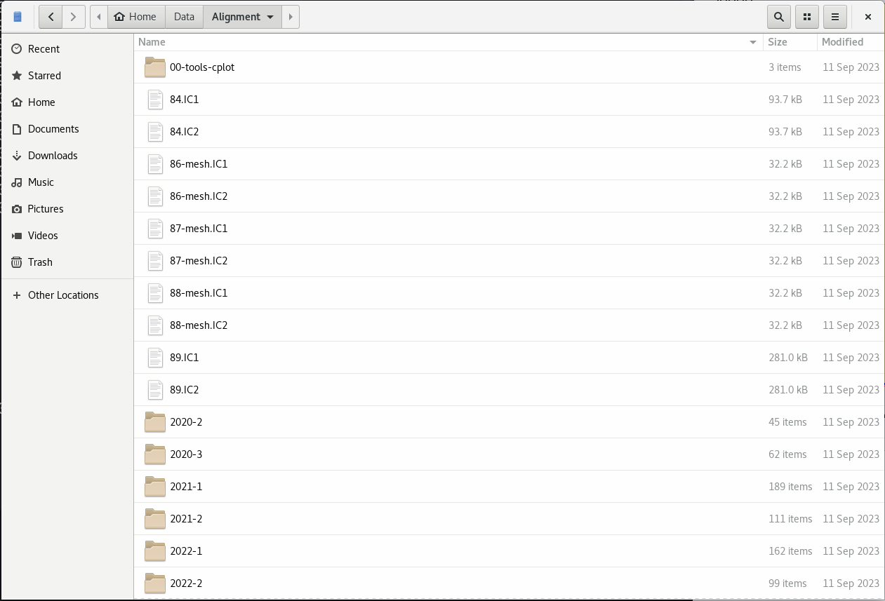

### Text Editor

Text Editor 是一個用來編輯文字檔案的程式，可以用來編輯 Macro、Script 等文字檔案。等同於 Windows 的 "記事本"。但是不建議在實驗進行中用來打開 Datafile 檔案，
因為可能造成檔案損毀。

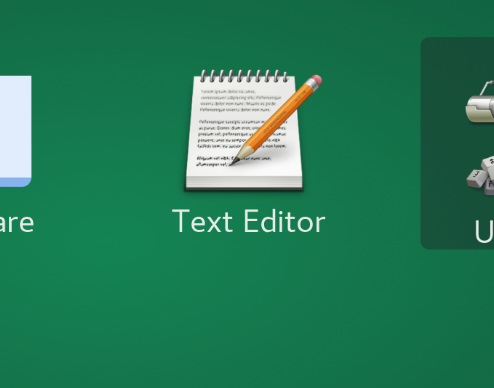 

---

## 繞射儀操作系統

TPS09A 使用 CSS SPEC FourC 繞射儀操作系統，使用者可以透過指令、函數、指令、變數等功能來控制繞射儀的運作。

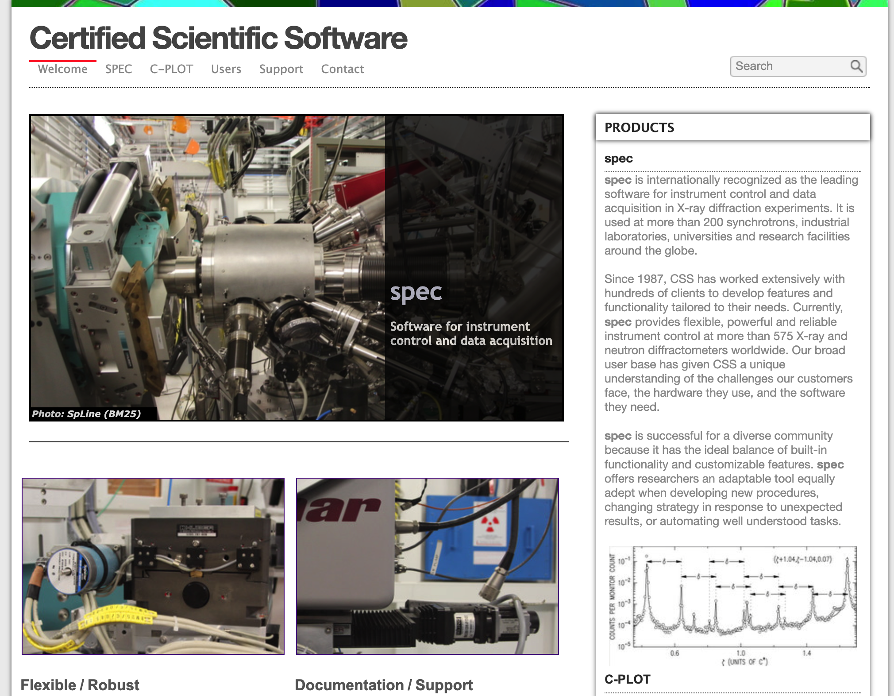

    https://www.css-spec.com/

Features

- Customized C-like Language
- Diffractometer & Motor & Detector
- Reciprocal Space Calculation System
- Text File Data Collection

### 使用者介面

實驗進行時，電腦桌面上看起來大概是這樣：

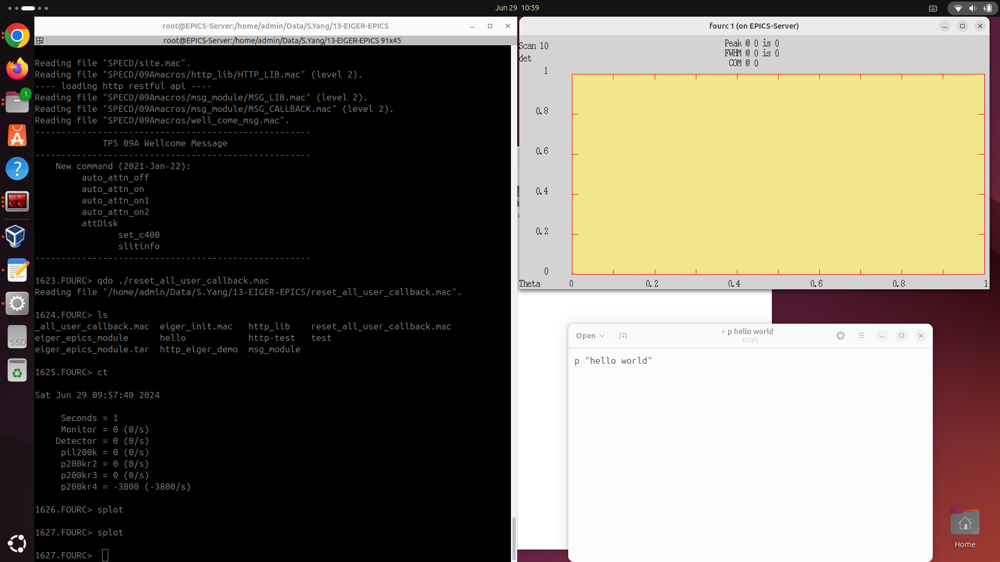

會有一個 Terminal Emulator 視窗，用來執行 `fourc` 系統。

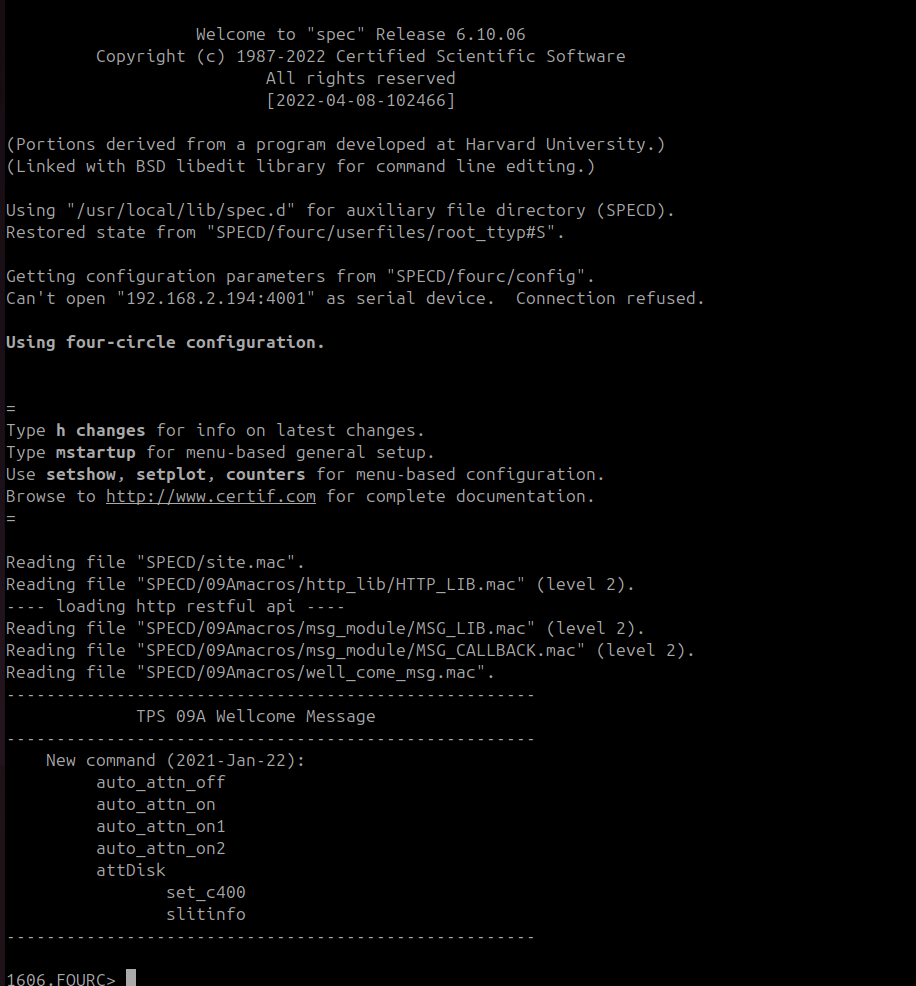

`fourc` 在進行實驗時，會有一個 GUI 介面，用來顯示實驗數據。

### DATAFILE : `fourc` 的實驗數據檔案

`fourc` 的實驗數據檔案是一個文字檔案(Text File)，用來記錄實驗數據。內容包含了實驗數據、所有馬達數值、空間參數等資訊，並以特定的格式儲存。

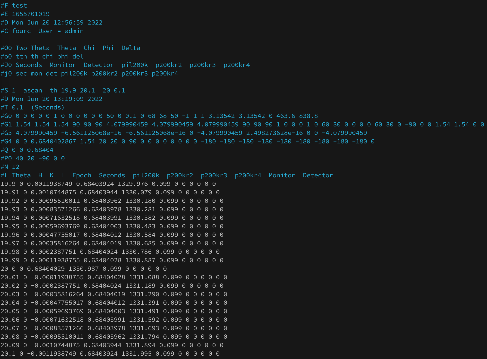

### C-like Language

`fourc` 的操作語言是一種類似 C 語言的程式語言，可以用來控制繞射儀的運作。使用者可以透過指令、函數、指令、變數等功能來控制繞射儀的運作。

#### 設備控制指令

    ct
    umv tth 20
    umv tth 20 th 10
    dscan th -1 1 20 1

#### 變數

    my_var_0 = 10
    my_var_1 = 10.0
    my_var_2 = "hello world"

#### 流程控制

if else

    if(my_var_0 == 10){
        p "my_var_0 is 10";
    }else{
        p "my_var_0 is not 10";
    }

for loop

    for(_idx=0; _idx<10; _idx++){
        p i;
    }

#### 函數&指令

定義函數

    def my_func(){
        p "my_func is called";
        return "end";
    }

呼叫函數

    my_func()
    _res = my_func()
    p _res

定義指令

    def my_command '{
        p "my_command is called";
    }'

呼叫指令

    my_command

查詢已定義的指令或函數內容

    prdef my_command

#### 註解使用 `#` 符號

    # this is a comment

    p "this is a comment"

#### 寫 Macro 注意事項

- 使用文字編輯器編寫 Macro，然後記得存檔
- 宣告變數時不要用到已經存在的變數名稱
- 使用指令`syms` 查詢目前已經存在的變數

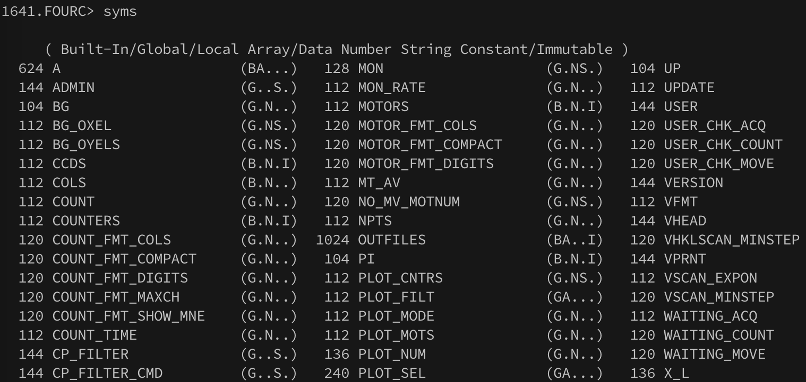 

- 使用指令`do <Macro 檔名>` 執行 Macro

---

## EPICS (Experimental Physics and Industrial Control System)

### Mark 

 

Official Website

    https://epics.anl.gov/

### CA (Channel Access)

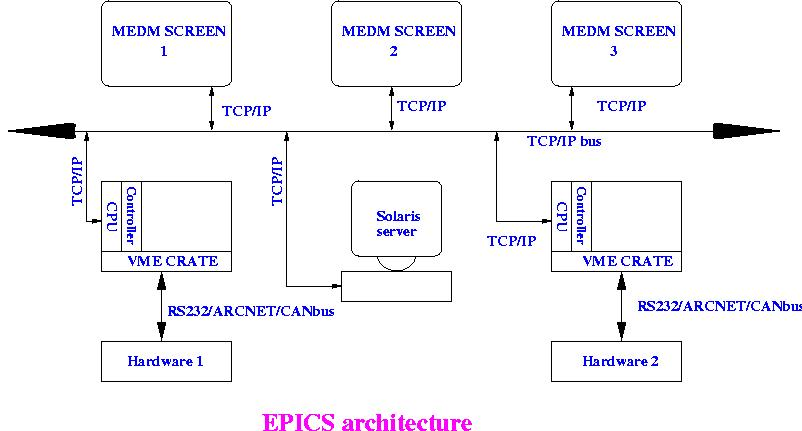

