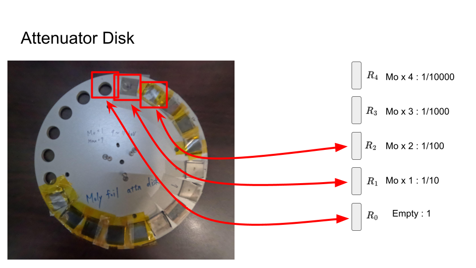

# 繞射實驗流程

## 繞射儀主要馬達動作


可動範圍 list 

    tth : -5˚ ~ 90˚
    th  : -5˚ ~ 40˚
    chi : -95˚ ~ 5˚
    phi : 0˚ ~ 360˚

### tth

<iframe width="560" height="315" src="https://www.youtube.com/embed/YPcGaWuBPEo?si=SWH8kVj4XxKCaBeM" title="YouTube video player" frameborder="0" allow="accelerometer; autoplay; clipboard-write; encrypted-media; gyroscope; picture-in-picture; web-share" referrerpolicy="strict-origin-when-cross-origin" allowfullscreen></iframe>

    可動範圍 : -5˚ ~ 90˚

### th

<iframe width="560" height="315" src="https://www.youtube.com/embed/tuBwzK4GwLM?si=dEaGIzA8rI0q6S9T" title="YouTube video player" frameborder="0" allow="accelerometer; autoplay; clipboard-write; encrypted-media; gyroscope; picture-in-picture; web-share" referrerpolicy="strict-origin-when-cross-origin" allowfullscreen></iframe>

    可動範圍 : -5˚ ~ 40˚

### chi

<iframe width="560" height="315" src="https://www.youtube.com/embed/vu5SkSc4_yU?si=GEuijC5e8cyDQvLk" title="YouTube video player" frameborder="0" allow="accelerometer; autoplay; clipboard-write; encrypted-media; gyroscope; picture-in-picture; web-share" referrerpolicy="strict-origin-when-cross-origin" allowfullscreen></iframe>

    可動範圍 : -95˚ ~ 5˚

### phi

<iframe width="560" height="315" src="https://www.youtube.com/embed/bjRUqMlDoEU?si=efxusyFvwJViggKp" title="YouTube video player" frameborder="0" allow="accelerometer; autoplay; clipboard-write; encrypted-media; gyroscope; picture-in-picture; web-share" referrerpolicy="strict-origin-when-cross-origin" allowfullscreen></iframe>

    可動範圍 : 0˚ ~ 360˚


## In-House Diffractometer


## 繞射儀其他馬達動作(矯正樣品方位用)

### phiz (樣品高度)

<iframe width="560" height="315" src="https://www.youtube.com/embed/T0nGvwHTIqs?si=af9o6JZmzOGL-tvd" title="YouTube video player" frameborder="0" allow="accelerometer; autoplay; clipboard-write; encrypted-media; gyroscope; picture-in-picture; web-share" referrerpolicy="strict-origin-when-cross-origin" allowfullscreen></iframe>

### farcx & farcy (樣平傾斜角)

<iframe width="560" height="315" src="https://www.youtube.com/embed/ZXQggy31Lbk?si=zFc_XkjYk2QHKdRm" title="YouTube video player" frameborder="0" allow="accelerometer; autoplay; clipboard-write; encrypted-media; gyroscope; picture-in-picture; web-share" referrerpolicy="strict-origin-when-cross-origin" allowfullscreen></iframe>


---
### 衰減片系統

如下圖所示，我們在鋁盤上的特定位置上打洞，並分別放置對應片數的鉬片或銅片，並使用步進馬達控制衰減片盤的轉動，用來選擇指定片數的衰減片放到 X-ray 光源會經過的地方。



控制衰減片盤轉動的馬達名稱為 `attn` ，可以使用指令 `att` 可以調整鉬片或銅片的數量。


    > att 0     <----- 不加衰減片
    > att 1     <----- 加一片鉬片
    > att 2     <----- 加兩片鉬片

另外在繞射強度分佈較廣的掃描中，我們也可以使用自動調整 X-ray 照射強度的功能。下面是相關的指令說明。

    開啟自動調整功能
    > auto_attn_on

    關閉自動調整功能
    > auto_attn_off

    設定指定衰減片的衰減倍率
    > attDisk 1 10.1

    > auto_attn_info      <---------- 查看自動調整功能的設定
    ============================
    AUTO ATTN    : ENABLE    ---> 自動調整功能開啟(ENABLE)/關閉(DISABLE)
    AUTO ATTN MAX:  10       ---> 最大衰減片數
    PROTECT PLUS :  0        ---> 最低衰減片數
    DET UPPER LIM:  30000    ---> 超過此值，自動調整功能會開始調整衰減片數
    DET LOWER LIM:  1000     ---> 低於此值，自動調整功能會開始調整衰減片數

系統內存有衰減片的數量和衰減倍率的對應表，可以使用下面的指令 `attDisk` 查看。

    > attDisk                      <--------- 輸入指令
    FileName : ~/macros/attDiskRatio/10keV.Mo1.20240624
    Attn	Real Ratio	Relative Ratio
    --------------------------------------
    Attn[0]	1.000e+00	1.000
    Attn[1]	1.190e+01	11.898      ----> att 1 的倍率
    Attn[2]	6.586e+01	5.535       ----> att 2 的倍率
    Attn[3]	5.507e+02	8.362
    Attn[4]	4.125e+03	7.490
    Attn[5]	3.433e+04	8.323
    Attn[6]	2.831e+05	8.247
    Attn[7]	2.152e+06	7.601
    Attn[8]	1.870e+07	8.692
    Attn[9]	2.806e+08	15.000
    Attn[10]	2.806e+09	10.000
    Attn[11]	2.806e+10	10.000
    Attn[12]	2.806e+11	10.000
    Attn[13]	2.806e+12	10.000
    Attn[14]	2.806e+13	10.000
    Attn[15]	2.806e+14	10.000
    Attn[16]	2.806e+15	10.000
    Attn[17]	2.806e+16	10.000
    Attn[18]	2.806e+17	10.000
    Attn[19]	2.806e+18	10.000

上面的倍率表中 `Relative Ratio` 欄位是衰減的**相對倍率**。

`Attn[1]` 的倍率是 `11.898`，代表相對於 `Attn[0]` 的倍率是 `11.898`。 

`Attn[0]` 的倍率是 `1`，代表沒有衰減，意即沒有衰減片。 

<br><br>

---
#### 校正衰減片的實際倍率

有時候我們會需要校正衰減片的**實際倍率**。

假設要量測 `Attn[6]` (第六片)的相對倍率(相對於上一片; 第五片 `Attn[5]`)。
實作上，我們會找到一個馬達位置在衰減片數為 6 的時候其繞射強度約在 1000 ~ 5000 cts/s 的位置:

    > att 6     <------------------- 使用衰減片 6
    ...         <---------  移動馬達到繞射強度約在 1000 ~ 5000 cts/s 的位置

    > ct        <---------  量測繞射強度
    ----------------------> 假設量測到的 det 強度為 4968 cts/s

    > att 5     <------------------- 使用衰減片 5
    > ct       <---------  量測繞射強度
    ----------------------> 假設量測到的 det 強度為 50149 cts/s


計算 `Attn[6]` 的實際倍率:

    `Attn[6]` 的實際倍率 : 50149 / 4968 = 10.09
    > attDisk 6 10.09      <---------- 設定 `Attn[6]` 的實際相對倍率


建議在 substrate 的繞射點附近來校正衰減片的實際倍率。


**注意事項**

    量測到的光超過 250,000 cts/s ，強度反應會變成非線性。

    量測到的光超過 1,000,000 cts/s ，detector 會被 ”打暈”

    打暈後的 detector 的不正常行為: 沒照光也會量到一個背景值。

    超過 1,000,000 cts/s 的光會量到一個不正常的值。

    detector 被打到的地方，會造成永久性損壞。

    經常把 detector 打暈的情形: 
        量直射光時沒加足衰減片
        量 substrate 的繞射點時沒加足衰減片
        轉動晶體和 detector 時，在沒有加足衰減片的情形下，經過很強的繞射點。


---


## 樣品製備&放置

### Sample Rod 


### 放置樣品

<iframe width="560" height="315" src="https://www.youtube.com/embed/rLIqrE-IX48?si=nbmlBtu8MMnhS8mK" title="YouTube video player" frameborder="0" allow="accelerometer; autoplay; clipboard-write; encrypted-media; gyroscope; picture-in-picture; web-share" referrerpolicy="strict-origin-when-cross-origin" allowfullscreen></iframe>

## 調整樣品位置到繞射中心

1. 紀錄直射光強度


    此時通常會用 umvr 指令調整 phiz 讓樣品不要擋住直射光。

    > umvr phiz -1 
    > ct

2. 調整 `phiz`


    同樣使用 umvr 調整 phiz 的位置，使得直射光大約被樣品擋到一半。

    > umvr phiz 0.1
    > ct
    > umvr phiz -0.1
    > ct

3. 調整 `th`


    這個時候通常樣品的表面和光是不平行的。所以要調整 th 使得繞射強度最大。

    > dscan th -0.5 0.5 20 1
    > pic

    有時候歪很多需要多做幾次。


4. 再次調整 `phiz`


    最後再 scan 一次 phiz ，範圍要略大於 1 mm。
    因為 beam size 大約是 0.8 mm。

    然後移到強度一半的位置。

    > dscan phiz -0.5 0.5 50 1
    > cen 

    cen 指令在偵測到 scan profile 為 step function 時，會自動找到強度一平的位置。


---

# 單晶薄膜樣品

## 尋找 Surface Normal 方向的繞射點

以 Si (0 0 4) 為例

    Si (0 0 4) 繞射面 d-space = 0.135 nm
    能量為 12keV 的 X-ray 波長為 1.033 Anstrom
    使用下面的公式可以計算出該繞射面的 tth 約為 44.7221˚。


    移動 tth 到 44.7221˚ ，th 到 22.3611˚ ，然後移動 chi 和 phi 使得繞射點在中心。

    > umv tth 44.7221 th 22.3611

    微調 tth, th, chi 使繞射強度為最大。(使用 umvr 和 dscan 調整)


---

## th, chi 馬達校正

當光束線的同仁調完光束線後，可以確定 tth 的角度是經過校正的。但是 th 和 chi 的角度需要再次校正。

下面的步驟是使用 Si (100) 基板的 (0 0 4) 面來校正 th 和 chi 的角度。

1. 在 phi = 0˚ 的情況下，調整 tth, th, chi 找到 Si (0 0 4) 繞射強度最大的位置。

    記錄此時的 th, chi 值。假定為 th_1, chi_1。

2. 移動 phi 到 180˚，調整 th, chi 使得 Si (0 0 4) 繞射強度最大。

    記錄此時的 th, chi 值。假定為 th_2, chi_2。

3. 校正 th 和 chi 


```
    移動 th 到 (th_1 + th_2) / 2, chi 到 (chi_1 + chi_2) / 2。

    > umv th (th_1+th_2)/2
    > umv chi (chi_1+chi_2)/2

    重新設定此時的 th  值為 tth 的 1/2
    重新設定此時的 chi 值為 -90˚。 

    > set th tth/2
    > set chi -90
```

此時完成 th 和 chi 的校正。之後 th 和 chi 的讀值就是正確的角度了。
在接下來的實驗中 `tth`、 `th`、 `chi` 不建議再使用 `set` 指令進行重設。    

---


## 四面調平(th, chi 尚未校正)

在 `th` 和 `chi` 尚未校正的情況下，進行四面調平的步驟會較為複雜。
因為需要同時校正 `th` 和 `chi` 且使用 `farcx` 和 `facry` 修正樣品的 orientation。 


1. 在 phi = 0˚ 的情況下，調整 tth, th, chi 找到 Si (0 0 4) 繞射強度最大的位置。

```
    記錄此時的 th, chi 值。假定為 th_1, chi_1。
```


2. 移動 phi 到 180˚，調整 th, chi 使得 Si (0 0 4) 繞射強度最大。

```
    記錄此時的 th, chi 值。假定為 th_2, chi_2。
```

3. 使用 farcy 修正，此時 phi 在 180˚


```
    移動 th 到 (th_1 + th_2) / 2

    重新設定此時的 th  值為 tth 的 1/2

    調整 farcy 使得 Si (0 0 4) 繞射強度最大。

    移動 chi 到 (chi_1 + chi_2) / 2。

    重新設定此時的 chi 值為 -90˚。 
```


4. 移動 phi 到 90˚，調整 th, chi 使得 Si (0 0 4) 繞射強度最大。


```
    此時 chi 應很接近 -90˚

    移動 th 到 tth 的 1/2 

    調整 farcx 使得 Si (0 0 4) 繞射強度最大。
```


---


## 四面調平(th, chi 已校正)

1. 在 phi = 0˚ 的情況下，調整 tth, th, chi 找到 Si (0 0 4) 繞射強度最大的位置。

2. 使用 farcy 修正，此時 phi 在 0˚ 

```
    移動 th 到 tth 的 1/2 

    調整 farcy 使得 Si (0 0 4) 繞射強度最大。

    !!注意!! 當 phi = 0˚, 180˚ 對應的是 farcy 的方向。
```

3. 移動 phi 到 90˚，調整 th, chi 使得 Si (0 0 4) 繞射強度最大。

```
    此時 chi 應很接近 -90˚
    移動 th 到 tth 的 1/2 
    調整 farcx 使得 Si (0 0 4) 繞射強度最大。

    !!注意!! 當 phi = 90˚, 270˚ 對應的是 farcx 的方向。
```

此時可以順便設定 pa 系統的 or0


```
    > setlat 
    ... (照順序輸入晶格常數)

    > or0 0 0 4
```


---


## 尋找全反射角

當要進行 X-ray Reflectivity (XRR) 實驗時，需要找到光學面的全反射角。下面是一個簡單的方法。

1. 移動 tth 到 2˚ ， th 到 1˚。

```
    角度夠低，且 tth 和 th 的比值為 2/1 的位置都可以試試看。
    2:1
    3:1.5
    4:2
    這些比值的位置都可以試試看。
    但是注意，角度太低可能會收到直射光。
```

2. scan th 和 chi 角度，找到反射強度最大的位置。

```
    理想上，經過四面調平後，直接移下來就可以找到反射強度最大的位置。
    樣品的光學面和 substrate 的晶軸會是平行的。

    實際上，大部份的 substrate 在切片出貨時或多或少會有些切不準。
    切不準的程度稱為 miscut ，供應商會在出貨時會標註出來。

    所以雖然經過四面調平後，系統會以 substrate 晶軸為主。
    而要找到光學面的反射時，會需要微調 th 和 chi。

    但就算沒有四面調平，經由砍光一半的流程也不可能直接移下來就找到反射強度最大的位置。
    還是需要微調 th 和 chi。
```


### 如果尚未校正 th, chi

則此時可以重新設定 th 為 1˚，chi 為 -90˚。

但是該 th 和 chi 的基準點系統會以光學面為主。


### 如果已經四面調平


此時 th 和 1˚ 的差值與 chi 和 -90˚ 即為 miscut 角度。

    miscut 
    ==============================
    abs( th  - 1     )
    abs( chi - (-90) )


所以如果只是來量 XRR 的話，砍光一半的流程之後，就可以直接找到反射強度最大的位置，
而不用四面調平。

---


## Reciprocal Space Mapping ( PA 系統)


fourc 的 reciprocal space 功能可以用來進行以倒晶格空間為主的繞射量測。
像是計算晶體 `(H, K, L)` 繞射面對應的 `(tth, th, chi, phi)` 位置、進行
以 `(H, K, L)` 空間座標軸為主的 scan 還有 `H-K`, `K-L`, `H-L` 倒晶格
空間的 mesh scan。

使用 fourc 的 reciprocal space 功能的前置條件:

    1. 設定晶格常數 (setlat)
    2. 找到兩個不平行的繞射面，並分別設定為主要向量 (or0, setor0) 與次要向量 (or1, setor1)
    3. 設定指定繞射模式 (setmode)
    4. 設定指定象限 (setsector)

### 1. 樣品的晶格常數

在 fourc 的操作介面中輸入指令 `setlat`，然後依序輸入晶格常數。

    > setlat
    
    Enter real space lattice parameters:
     Lattice a (5.4)?                        <-- 輸入 lattice constant a 單位為 Å
     Lattice b (5.4)?                        <-- 輸入 lattice constant b 單位為 Å
     Lattice c (5.4)?                        <-- 輸入 lattice constant c 單位為 Å
     Lattice alpha (90)?                     <-- 輸入 lattice alpha 單位為 degree
     Lattice beta (90)?                      <-- 輸入 lattice beta 單位為 degree
     Lattice gamma (90)?                     <-- 輸入 lattice gamma 單位為 degree
    (UB recalculated from orientation reflections and lattice.)

### 2. 兩個樣品的 reciprocal lattice vector。(互相不平行)

在 fourc 的操作介面中使用指令 `or0` 設定主要的 reciprocal lattice vector。

    指令如下:
    > or0 H K L

    假設當下已經位於 Si (0 0 4) 的繞射點。則設定主要 reciprocal lattice vector 為 (0 0 4) :
    > or0 0 0 4

在 fourc 的操作介面中使用指令 `or1` 設定次要的 reciprocal lattice vector。

    指令如下:
    > or1 H K L

    假設當下已經位於 Si (1 1 1) 的繞射點。則設定次要 reciprocal lattice vector 為 (1 1 1) :
    > or1 1 1 1

如果已知 reciprocal lattice vector 的馬達角度，可以使用下面的指令直接設定。

設定主要 reciprocal lattice vector:

    > setor0
    Enter primary-reflection angles:
     Two Theta (0)?   <-- 輸入 tth, ex: 44.9885
     Theta (0)?       <-- 輸入 th,  ex: 22.4940
     Chi (0)?         <-- 輸入 chi, ex: -90
     Phi (0)?         <-- 輸入 phi, ex: 0
    
    Enter primary-reflection HKL coordinates:
     H (0)?  <-- 輸入 H, ex: 0
     K (0)?  <-- 輸入 K, ex: 0 
     L (0)?  <-- 輸入 L, ex: 4
    (UB recalculated from orientation reflections and lattice.)


設定次要 reciprocal lattice vector:

    > setor1
    Enter primary-reflection angles:
     Two Theta (0)?   <-- 輸入 tth, ex: 19.072
     Theta (0)?       <-- 輸入 th,  ex: 9.536
     Chi (0)?         <-- 輸入 chi, ex: -35.264
     Phi (0)?         <-- 輸入 phi, ex: 9.9
    
    Enter primary-reflection HKL coordinates:
     H (0)?  <-- 輸入 H, ex: 1
     K (0)?  <-- 輸入 K, ex: 1 
     L (0)?  <-- 輸入 L, ex: 1
    (UB recalculated from orientation reflections and lattice.)


### 3. 指定繞射模式

在 fourc 的操作介面中使用指令 `setmode` 設定繞射模式。系統指供下列 8 個繞射模式。

    > setmode
    Choose a four-circle geometry mode:

    0 Omega equals zero        <-- 常用模式 tth/th = 2/1
    1 Omega fixed
    2 Zone (Chi and Phi fixed)
    3 Phi fixed (Three-circle) <-- 常用模式 固定 phi 角度
    4 Azimuth fixed
    5 Alpha fixed
    6 Beta fixed
    7 Theta fixed
    
    Your choice (0)?  <-- 輸入繞射模式，ex: 0

通常使用 `0 Omega equals zero` 繞射模式。該模式下會固定 `tth/th` 的比值為 `2/1`。

模式 `3 Phi fixed (Three-circle)` 會固定 `phi` 的角度。然後另外調整 `th` 和 `chi` 去滿足繞射條件。
使用該模式時，需要使用指令 `freeze` 設定 `phi` 的角度，然後在切換到其他模式時要使用指令 `unfreeze` 解除固定。

假設我們要固定 phi = 45˚，則使用下面的指令:

    > setmode 3
    > freeze 45

接著要回到正常模式，使用下面的指令:

    > setmode 0
    > unfreeze

一般來說，通常在 **使用 reciprocal space 功能時** 模式的選擇方式:

    如果是在 off-normal 和 in-plane 的繞射區域實驗時會使用 setmode 0 模式。

    然而在 sruface-normal 的繞射區域時，會使用 setmode 4 固定住 phi ，不然 phi 會亂跑。

### 4. 指定繞射象限

在計算 off-normal 和 in-plane 的 (H, K, L) 馬達對應位置時，如果沒有馬達的範圍限制，則會多個解。
這時候會需要指定繞射象限，讓系統只計算特定象限的解。而在 TPS09A 的硬體設計上，
只有 2 個象限可以選擇: 0 和 4。

通常在驗算 (H, K, L) 時，會發現 chi 角超出範圍，這時候就需要指定到另一個繞射象限。例如:

假設我們使用 ca 指令計算 (0 1 1) 的馬達位置。發現 chi 為 -135˚，超出 chi : -95˚~5˚ 的範圍。

    1693.FOURC> ca 0 1 1
    
    Calculated Positions:
    
    H K L =  0  0.99999  1
    Alpha = 7.774  Beta = 7.774  Azimuth = 89.999
    Omega = 0  Lambda = 1.033
    
    Two Theta     Theta       Chi       Phi
      15.5480    7.7740 -135.0000  135.0000          --------> -135˚ 超出 chi 的可動範圍 (-95˚~5˚)
    
    1694.FOURC>

此時就需要切換象限。

    1694.FOURC> setsector         <------ 執行切換象限
    
    Geometry sector (4)? 0        <------ 原本是 4 ，輸入 0 
    Now using no sector transformations.
    
    1695.FOURC> ca 0 1 1          <------ 再計算一次 (0 1 1) 的位置
    
    Calculated Positions:
    
    H K L =  0  0.99999  1
    Alpha = 7.774  Beta = 7.774  Azimuth = -90.001
    Omega = 0  Lambda = 1.033
    
    Two Theta     Theta       Chi       Phi
      15.5480    7.7740  -45.0000  -45.0000    ------> 發現 chi 在範圍內了，代價是 phi 也會跑到另一邊
    
    1696.FOURC>

    
### 5. 最後確定所有設定

指令 `pa` 可以列出目前倒晶格空間的設定。

    > pa
        
    Four-Circle Geometry, Phi fixed (Three-circle) (mode 3)  --> 確認繞射模式
    Frozen values:  Phi = 45
    Sector 0           ----------------------------------------> 確認繞射象限
    
      Primary Reflection (at lambda 1.033):
              tth th chi phi = 44.9885 22.494 -90 0   ---------> 確認主要繞射點
                       H K L = 0 0 4
    
      Secondary Reflection (at lambda 1.033):
              tth th chi phi = 19.072 9.536 -35.264 0  --------> 確認次要繞射點
                       H K L = 1 1 1
    
      Lattice Constants (lengths / angles):
                  real space = 5.4 5.4 5.4 / 90 90 90  --------> 確認晶格常數
            reciprocal space = 1.164 1.164 1.164 / 90 90 90
    
      Azimuthal Reference:
                       H K L = 0 1 1
    
                      Lambda = 1.033         ------------------> 確認波長
    
     Cut Points:
          tth   th  chi  phi
         -180 -180 -180 -180


#### 完成所有設定後

執行 `wh` 指令，其所顯示的 (H, K, L) 位置才會是正確的。

    1706.FOURC> wh
    
    H K L =  1  0  0.99999       ---------------------> 當下的馬達位置對應的(H, K, L)
    Alpha = 50.196  Beta = -39.27  Azimuth = 144.74
    Omega = 0  Lambda = 1.033
    
    Two Theta     Theta       Chi       Phi
      15.5480    7.7740  -45.0000   45.0000
    

---

## 使用 reciprocal space 功能

使用 fourc 進行 (H, K, L) 空間的移動和量測之前，務必使用 `ca` 先行驗算。

例如，目前馬達已在 (1 0 1) 的位置上

    1705.FOURC> wh
    
    H K L =  1  0  0.99999
    Alpha = 50.196  Beta = -39.27  Azimuth = 144.74
    Omega = 0  Lambda = 1.033
    
    Two Theta     Theta       Chi       Phi
      15.5480    7.7740  -45.0000   45.0000

欲在當下的位置上進行 `hscan` ，先驗算起點和終點

    1733.FOURC> ca H K L      <---- 對當下的位置驗算
    
    Calculated Positions:
    
    H K L =  1  0  0.99999
    Alpha = 50.196  Beta = -39.27  Azimuth = 144.74
    Omega = 0  Lambda = 1.033
    
    Two Theta     Theta       Chi       Phi
      15.5480    7.7740  -45.0000   45.0000
    
    1734.FOURC> ca H-0.1 K L    <------------- 驗算 hscan 的起點
    
    Calculated Positions:
    
    H K L =  0.89998  5.5616e-06  0.99998
    Alpha = 50.252  Beta = -39.316  Azimuth = 146.22
    Omega = 0  Lambda = 1.033
    
    Two Theta     Theta       Chi       Phi
      14.7865    7.3930  -48.0130   45.0000   <-- 確定馬達位置ok
    
    1735.FOURC> ca H+0.1 K L   <------------- 驗算 hscan 的終點
    
    Calculated Positions:
    
    H K L =  1.1  3.0851e-07  0.99997
    Alpha = 50.135  Beta = -39.219  Azimuth = 143.5
    Omega = 0  Lambda = 1.033
    
    Two Theta     Theta       Chi       Phi
      16.3490    8.1745  -42.2735   45.0000   <-- 確定馬達位置ok


確定都沒有問題了，再開始 scan :

```
    1736.FOURC> hscan H-0.1 H+0.1 40 1
```

注意:

    (H, K, L) 空間的移動所輸入的座標位置都是 "絕對位置"
    (H, K, L) 空間的 scan 結束後，都會停留在結束的位置，不會回到指令執行前的位置。

    H, K, L 三個變數為系統變數，會在所有 scan 動作或馬達移動結束時，把當下的 (H, K, L)
    位置寫入。


## XRR

XRR 實驗第一步是要找到光學面的全反射角。通常會先到接近全反射角的理想位置，然後再微調。

ex: 移動 tth 到 2˚ ， th 到 1˚。

    > umv tth 2 th 1

此時很有可能沒有偵測到反射強度，通常表示 th 或 chi 角的有誤差。

這時候就要用 scan 和 umvr 指令來尋找 th 和 chi 的正確位置來找到反射強度最大的位置。

如果先前已經過四面調平，則此時的 th 和 chi 的角度和理想位置的差距可視為 miscut 。


    miscut 
    ==============================
    miscut_th  = th  - 1
    miscut_chi = chi - (-90)


如果已經過四面調平或 th 和 chi 的馬達校正，則不建議在此時重設 th 和 chi。

而進行 XRR 實驗時，可以代入 th 的 miscut 值來修正 th 的角度。

計算 miscut :

    miscut = th - 1

開始 XRR scan : 

    att 7
    auto_attn_on
    ascan tth  0  1    th    0+miscut  0.5+miscut   100  1
    ascan tth  1  5    th  0.5+miscut  2.5+miscut   100  1
    auto_attn_off
    att 7

上面一系列的指令是進行 XRR scan 的範例，可以直接複製貼上到 macro 檔案中，然後使用 `do` 指令執行。假設檔案名稱為 `xrr.mac`，則執行指令如下:

    > do xrr.mac

<br>
<br>
<br>
<br>

----

# cryostat 操作手冊 

cryostat 功能啟動後，會有兩個溫度 Sensor。會在每次 `ct` 或 `scan` 的時候將之分別顯示在 `TempA` 和 `TempB`。

開啟 cryostat 功能

    > ther_switch 1

關閉 cryostat 功能

    > ther_switch 0

設定溫度 (溫度單位為˚K)

    > ther_set_temp 10    <----- 設定目標溫度為 10˚K

顯示 cryostat 狀態

    > ther_info


    1987.FOURC> ct
    
    Sun Aug 04 09:29:22 2024
    
          Second = 1
         Monitor = 0 (0/s)
        Detector = 0 (0/s)
             IC1 = 122 (122/s)
             IC2 = 870 (870/s)
             IC3 = 0 (0/s)
           Igate = 0 (0/s)
           GAP_A = 25 (25/s)
         CURRENT = 0 (0/s)
          c400_t = 0 (0/s)
             IC5 = 0 (0/s)
           C400B = 0 (0/s)
           C400A = 0 (0/s)
         cnt_att = 8 (8/s)
           count = 0 (0/s)
           TempA = 299.92 (299.92/s)   -----> TempA 為 cryostat 主要 Sensor 溫度
           TempB = 298.1 (298.1/s)     -----> TempB 為 cryostat 次要 Sensor 溫度

    > umv ztran 0.1    <----- 移動 ztran 0.1 mm


<br>
<br>
<br>
<br>

----

# DCS500 操作手冊 

DCS500 功能啟動後，有一個溫度 Sensor。會在每次 `ct` 或 `scan` 的時候將之顯示在 `TempA`。

開啟 DCS500 功能

    > ther_switch 2

關閉 DCS500 功能

    > ther_switch 0

設定溫度 (溫度單位為˚C)

    > ther_set_temp 10    <----- 設定目標溫度為 10˚C

設定升降溫速度

    > ther_set_ramp 1     <------ 設定升降溫速度為 1˚C/min

顯示 DCS500 狀態

    > ther_info


    1987.FOURC> ct
    
    Sun Aug 04 09:29:22 2024
    
          Second = 1
         Monitor = 0 (0/s)
        Detector = 0 (0/s)
             IC1 = 122 (122/s)
             IC2 = 870 (870/s)
             IC3 = 0 (0/s)
           Igate = 0 (0/s)
           GAP_A = 25 (25/s)
         CURRENT = 0 (0/s)
          c400_t = 0 (0/s)
             IC5 = 0 (0/s)
           C400B = 0 (0/s)
           C400A = 0 (0/s)
         cnt_att = 8 (8/s)
           count = 0 (0/s)
           TempA = 30 (30/s) ---------> TempA 為 DCS500 主要 Sensor 溫度
           TempB = 30 (30/s)


<br>
<br>
<br>
<br>

----

# EIGER 操作手冊 

使用 EIGER 的一些注意事項:

    1. EIGER 的 ROI 1, 2, 3, 4 會對應到 PIL200k, PIL200kR2, PIL200kR3, PIL200kR4 的 detector 。
    2. EIGER pixel 的大小是 75 um x 75 um。
    3. EIGER 每個 pixel 的 intensity 讀值不要超過 60,000 counts
    4. 每張 EIGER 的影像資料大小約為 4.2 MB 左右。建議帶 USB HDD 之類的東西過來 download 。
    5. EIGER 的影像格式會以 tiff 和 hdf5 格式為主。建議使用 python3 程式碼處理。

開啟 EIGER 功能

    > eiger_enable

關閉 EIGER 功能

    > eiger_disable

查看 EIGER 狀態

    > eiger_info
    ------------------ Eiger Info ---------------------
      FourC Connect : DISABLE
    -- Subsystem --
      File Writer   : Enable
      Stream        : Enable
      Monitor       : Disable
    ------------------ ROI 1 ---------------------
      X   : start [0] , size[1028]
      Y   : start [0] , size[1062]
    ------------------ ROI 2 ---------------------
      X   : start [300] , size[500]
      Y   : start [50] , size[500]
    ------------------ ROI 3 ---------------------
      X   : start [100] , size[300]
      Y   : start [100] , size[400]
    ------------------ ROI 4 ---------------------
      X   : start [200] , size[200]
      Y   : start [200] , size[200]
    ----------------------------------------------


下圖為一個 EIGER 的影像資料，intensity 取 log 並且使用 color map "viridis"。


下面為簡單的 `python3` 程式碼，可以將 EIGER 的影像資料取 log 並且使用 color map "viridis" 來顯示。

```python
    import sys, pathlib
    import numpy as np
    import tifffile
    import matplotlib.pyplot as plt
    
    fn = 'data.tiff'
    
    # --- get numpy 2d array from tiff file -----
    array_data = tifffile.imread(fn).astype('int32')
    
    
    # --- plot linear scale ---
    # plt.imshow(array_data, cmap='viridis')
    
    # --- plot log scale ---
    plt.imshow(np.log(array_data), cmap='viridis')
    plt.show()
```

使用 EIGER 系統時，可以設定其中四個 ROI 的位置和大小。這樣可以只讀取感興趣的區域，減少資料量。

下面為執行 `ct` 指令後，EIGER 的四個 ROI 回傳數據 (ROI summation) 的存放位置。 


    1984.FOURC> ct
    
    Sun Aug 04 09:27:38 2024
    
          Second = 1
         Monitor = 0 (0/s)
        Detector = 0 (0/s)
             IC1 = 116 (116/s)
             IC2 = 865 (865/s)
             IC3 = 0 (0/s)
             APD = 0 (0/s)
           Igate = 0 (0/s)
         SCREEN2 = 0 (0/s)
           GAP_A = 25 (25/s)
          c400_t = 0 (0/s)
           C400B = 0 (0/s)
          c400_3 = 0 (0/s)
          c400_4 = 0 (0/s)
           C400A = 0 (0/s)
         PIL200k = 0 (0/s)  ---------> EIGER ROI 1
       PIL200kR2 = 0 (0/s)  ---------> EIGER ROI 2
       PIL200kR3 = 0 (0/s)  ---------> EIGER ROI 3
       PIL200kR4 = 0 (0/s)  ---------> EIGER ROI 4
         cnt_att = 8 (8/s)
           count = 0 (0/s)
           TempA = 299.92 (299.92/s)
           TempB = 298.1 (298.1/s)

使用 E
