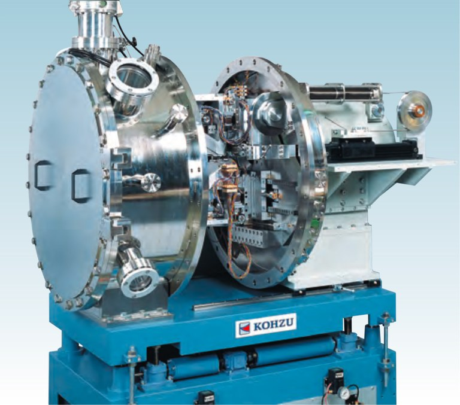
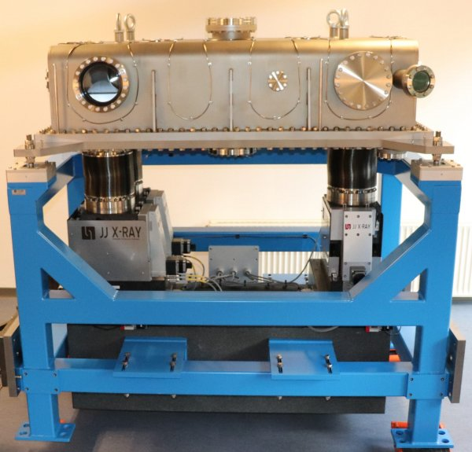
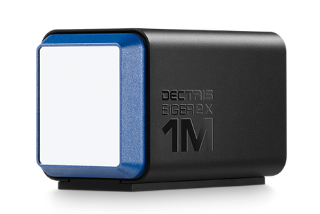

# 1. Beamline Introduction

    https://youtu.be/GTfGjObx2ww

Optical Layout

Specification

## 1.1. X-ray Source : Undulator

An undulator is a device that produces X-rays. It works by aligning a series of magnets in a straight line to create a magnetic field. When an electron beam passes through this field, it wobbles due to the Lorentz force, and this wobbling produces X-rays.

By changing the strength of the magnetic field, the wavelength of the X-rays can be adjusted. The diagram below shows the energy distribution of X-rays at a fixed magnetic field strength.

## 1.2. Double Crystal Monochromator (DCM) 

The X-rays from an undulator are a broad range of wavelengths, so a Double Crystal Monochromator (DCM) is used to filter out a specific wavelength.

A DCM has two crystals: the first one is the incident crystal, and the second is the exit crystal. By adjusting their angle, you can choose a specific X-ray wavelength.

Because the light from the undulator is very intense, the DCM gets very hot, so it is cooled with liquid nitrogen to keep the crystals at a steady temperature. If the temperature isn’t stable, the X-ray wavelength can change, which can affect the experiment.

reference : `https://www.kohzuprecision.com`

reference : `https://core.ac.uk/download/pdf/193744428.pdf`

## 1.3. Horizontal Focusing Mirror (HFM)

After passing through the DCM, the light is focused using a Horizontal Focusing Mirror (HFM).

The Horizontal Focusing Mirror (HFM) is a curved mirror with special coatings. These coatings reflect certain X-ray wavelengths and let higher wavelengths pass through.

At TPS09A, the HFM uses three different coatings: Rh, Si, and Pt. You can switch between them to handle different X-ray wavelengths. The diagram below shows the energy distribution for each coating.

## 1.4. High Resolution Monochromator (HRM) (optional)

The High-Resolution Monochromator (HRM) is composed of four single Si crystals. It is used to further filter specific X-ray wavelengths, offering higher resolution than a DCM, allowing for the selection of narrower wavelength ranges. The light path and diffraction angles used are shown in the diagram below.

At TPS09A, the HRM is made up of four Si crystals. The light path and the diffraction angles used are shown in the diagram below.

The HRM requires very high temperature stability. If the HRM’s temperature is not stable, it can cause fluctuations in the X-ray wavelength, which may affect the experimental results.

## 1.5. Diffractometer System

TPS09A uses the Huber X diffractometer which is a six-axis diffractometer, and it is equipped with an additional small diffraction ring in front of the detector that can be used as an analyzer.

 

## 1.6. Detector 

### Ion Chamber 

An Ion Chamber is a type of detector used to measure X-ray intensity. The principle behind it is that when X-rays pass through the detector, the gas inside is ionized, producing free electrons. These electrons are attracted by the electric field within the detector, generating a current in the range of nA to µA. The magnitude of this current is directly proportional to the intensity of the X-rays.

This small current is read by an electrometer (Keithley 6400 series), which converts it into an analog voltage signal. This signal is then converted into a digital signal by a converter and fed into a counter.

At TPS09A, nitrogen or argon is used as the gas inside the detector, with a pressure of about 1 atm. Ion Chambers are generally used to observe changes in X-ray intensity and are not suitable for high-resolution experiments.

### Scintillator counter (C400)

The principle of a scintillation counter is that when the scintillation crystal is exposed to X-rays, it gets excited and emits photons. These photons are then detected by a photomultiplier tube (PMT) and processed through a signal conversion circuit.

Due to its high sensitivity, TPS09A primarily uses scintillation counters as the detector for diffraction signals.

When using a scintillation counter, it’s important to monitor the intensity of the X-ray signal, as an excessively strong signal can cause the scintillation crystal to become saturated or even **damaged**.

 

### Area Detector (EIGER)

TPS09A uses the DECTRIS EIGER2 as a two-dimensional detector. The measurement results are displayed as 2D images on the computer screen and stored.

Since each measurement generates a large amount of data, it is saved in TIFF image files or HDF5 file formats. The memory, hard drive space, and programming skills required to process this data can be significant challenges.

 

### Avalanche Photodiode (APD)

An APD (Avalanche Photodiode) is a type of semiconductor photodetector, essentially a PIN diode, that operates under a reverse bias voltage within the avalanche breakdown range. When photons strike the APD, electron-hole pairs are generated. These electrons are accelerated by the electric field, causing an avalanche effect within the crystal, which produces a current signal.

Due to its high sensitivity to light intensity and good time resolution, APDs are commonly used in time-resolved diffraction experiments.

 

## Slits

TPS09A uses a slit system like the one shown in the following picture. This slit system consists of four metal blades—top, bottom, left, and right—each controlled by a stepper motor.

Two sets of slits are positioned upstream of the sample to measure the size and direction of the beam.

Additionally, two sets of slits are placed upstream of the detector to filter out unwanted scattered light.

## 1.7. Sample Temperature Control System

When temperature-controlled experiments are required, a Sample Temperature Control System can be used. TPS09A provides two such systems: Cryostat and DCS500.

For temperature variation experiments, the sample needs to be mounted on the Sample Temperature Control System, which is then installed on the X-ray diffractometer.

### Cryostat

- Temperature Range： 10K ~ 300K

The sample needs to be attached to a **copper holder** using **silver paint**, and then the holder is mounted onto the Cryostat. For cooling, a beryllium chamber must be installed and then vacuuming of the system begins.

Due to the mechanical structure of the Cryostat, the phi axis rotation is limited to about 100˚. Therefore, special attention must be given to the positioning of the sample during installation.

Since the Cryostat uses a helium gas compressor cooling system, which involves connecting gas lines and motor control cables, extra care must be taken when moving the motors to avoid any issues with things getting caught or tangled.

### DCS500

- Temperature Range： -180˚C ~ 500˚C

The sample needs to be clamped onto the DCS500 body using a mechanism similar to a paperclip, as shown in the diagram. If the sample is too small to be securely clamped, it should first be attached to a thermally conductive holder using silver paste, and then clamped to the DCS500 with the paperclip-like mechanism.

Before heating or cooling the sample, a carbon protective cover must be installed to shield the sample from environmental influences. Therefore, if the sample is too large to fit inside the protective cover, the DCS500 cannot be used for temperature variation experiments.

# In-House XRD System

The internal X-ray diffraction system is located in the L107 laboratory of the Yanguang Building. Access to this laboratory requires authorization, and users must apply for access rights. In addition, users must pass an qualification before applying to use the system.

The in-house XRD system uses a RigaKu source with Cu Kα 1.54056 Å as the X-ray wavelength. Users are expected to operate the system independently, including powering it on and off, and adjusting the voltage and current. The operation panel is shown in the diagram below.

The X-ray beam passes through a Ge crystal for filtering at the beam exit. The diagram below shows the container where the Ge crystal is placed.

The diagram below shows the 4-circle diffractometer.

The in-house XRD system uses combinations of different numbers of copper foils as attenuators to achieve various attenuation levels.

