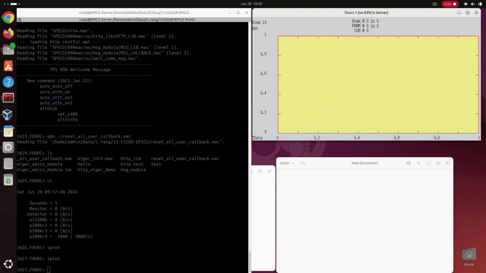
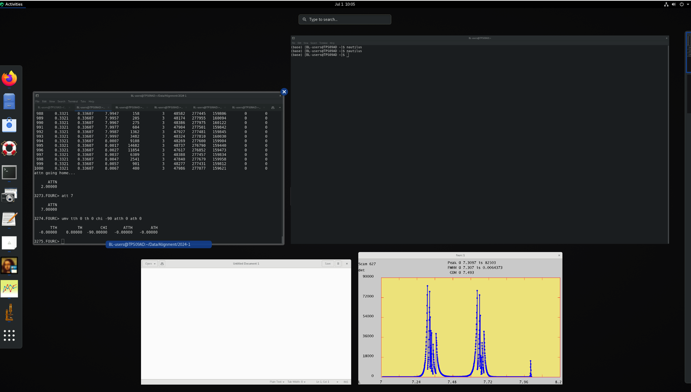
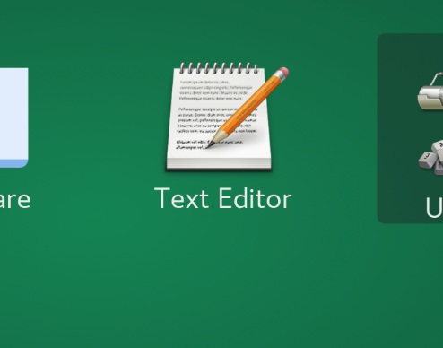
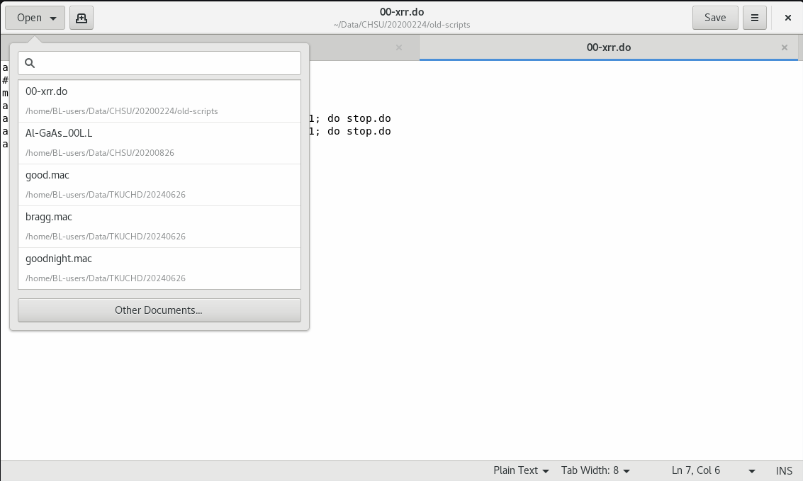
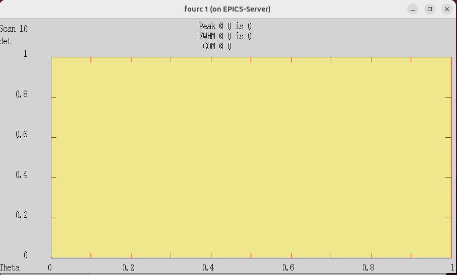
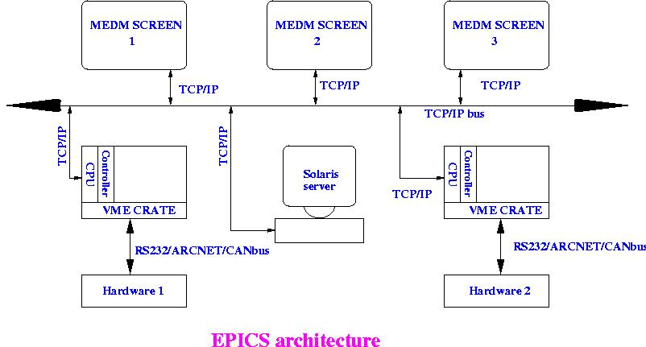

# Operation System

In this context, “Operation System” refers to the various systems used in the laboratory, including computer operating systems, instrument operation systems, and EPICS.

A computer’s operating system is the software that manages hardware and software resources, examples of which include Windows, Linux, and MacOS. Windows is commonly used in everyday life, while Linux is an open-source operating system with many different versions, such as Ubuntu, CentOS, and Debian. TPS09A currently uses Rocky Linux 8.4, a version derived from CentOS 8.

CSS SPEC FourC is a control system used primarily for operating diffractometers, including motor and detector control, as well as data collection. It also offers a programming language similar to C and a development framework, allowing administrators to develop specific functions.

EPICS (Experimental Physics and Industrial Control System) is a software framework designed for the integration and management of scientific instruments. It is widely used by particle accelerators and other large-scale scientific research facilities for system integration. EPICS includes tools for building and controlling systems, as well as a network communication protocol called Channel Access (CA). In synchrotron radiation facilities, EPICS is used to control beamline equipment and collect data from various sensors. This system framework reduces the technical barrier for beamline managers in equipment control.

## Computer Operation System

Linux : Rocky Linux 8.4

## windows key 

Important Tip! Using Windows keyboard shortcuts can help you quickly find and switch to the window you need among multiple open windows.

## Start Menu

Clicking the Start Menu button in the bottom left corner opens the Start Menu, where you can launch applications such as a text editor or File Manager.

### File System

All users share the same **User ID**.

    BL-users

and share the same **Home Directory**.

    /home/BL-users/

However, each laboratory has its own directory, for example:

    /home/BL-users/Data/<Your Lab Directory>

Different laboratories have their own directories, so please confirm your laboratory’s directory. Additionally, please avoid altering the contents of other users’ directories.

### Terminal Emulator

繞射儀操作系統需在文字指令介面(Command Line Interface) 的環境下執行，需要使用 Terminal Emulator 來執行 `fourc`。

### File Manager

The File Manager is a program used to manage files, allowing you to create, delete, copy, and move files.

 

### Text Editor

The **Text Editor** is a App used to edit text files, such as Macros and Scripts. It is equivalent to “Notepad” in Windows. However, it is not recommended to use the Text Editor to open **FourC DATAFILES (where all scan data is stored)** during an experiment, as this could potentially corrupt the files.

 

---

## Diffractometer Operation System

TPS09A uses the **CSS SPEC FourC** diffractometer operation system, allowing users to control the diffractometer through commands, functions, and variables.

    https://www.css-spec.com/

Features

- Customized C-like Language
- Diffractometer & Motor & Detector
- Reciprocal Space Calculation System
- Text File Data Collection

### User Interface

During the experiment, the computer desktop typically looks something like this:

There will be a **Terminal Emulator** window view open, which is used to run the **FourC** system.

When running experiments with FourC, there will be a GUI interface that displays the scanning data.

### DATAFILES (where all scan data of FourC is stored)

The experimental data files generated by FourC are standard text files that record experimental data. These files include information such as experimental data, all motor values, and reciprocal lattice space parameters, and they are stored in a specific format.

Users can use the PyMca application to read and process the data. This application can be downloaded from the following website:

    https://www.silx.org/doc/PyMca/dev/index.html

### C-like Language

The FourC operation language is a programming language similar to C, used to control the operation of the diffractometer. Users can control the diffractometer by utilizing commands, functions, and variables.

#### Commands

    ct
    umv tth 20
    umv tth 20 th 10
    dscan th -1 1 20 1

#### Variables 

    my_var_0 = 10
    my_var_1 = 10.0
    my_var_2 = "hello world"

#### Flow Control

if else

    if(my_var_0 == 10){
        p "my_var_0 is 10";
    }else{
        p "my_var_0 is not 10";
    }

for loop

    for(_idx=0; _idx<10; _idx++){
        p i;
    }

#### Definition of Function and Command

Define Function 

    def my_func(){
        p "my_func is called";
        return "end";
    }

Call Function

    my_func()
    _res = my_func()
    p _res

Define Command

    def my_command '{
        p "my_command is called";
    }'

Call Command

    my_command

Print the definition of a function or command

    prdef my_command

#### User the `#` to write a comment

    # this is a comment

    p "this is a comment"

#### Attention (writing Macro)

- Write the Macro using a text editor, and remember to save the file.
- When declaring variables, avoid using names that are already in use.
- Use the command `syms` to list and check the currently existing variables.

 

how ot execution Macro : 

    > do <Macro filename>

---

## EPICS (Experimental Physics and Industrial Control System)

### Mark 

 

Official Website

    https://epics.anl.gov/

### CA (Channel Access)

