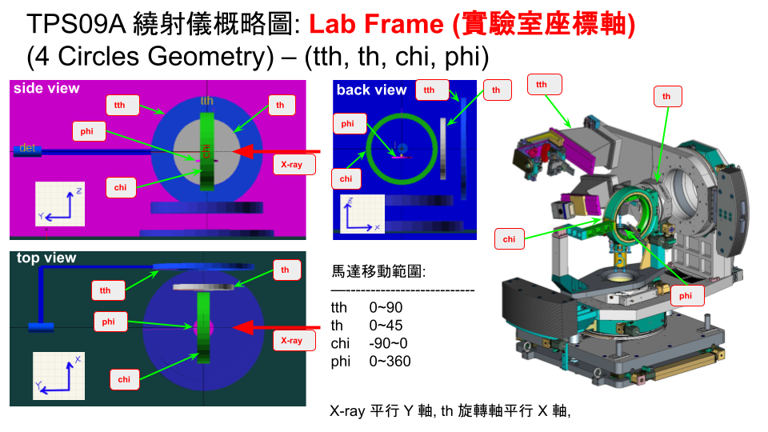
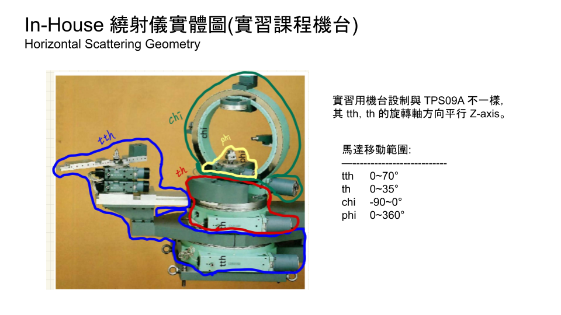
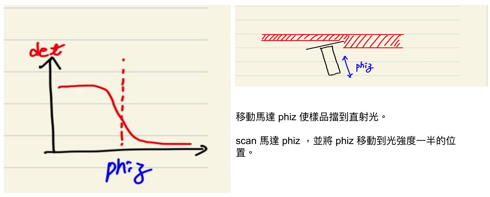
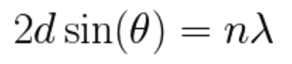
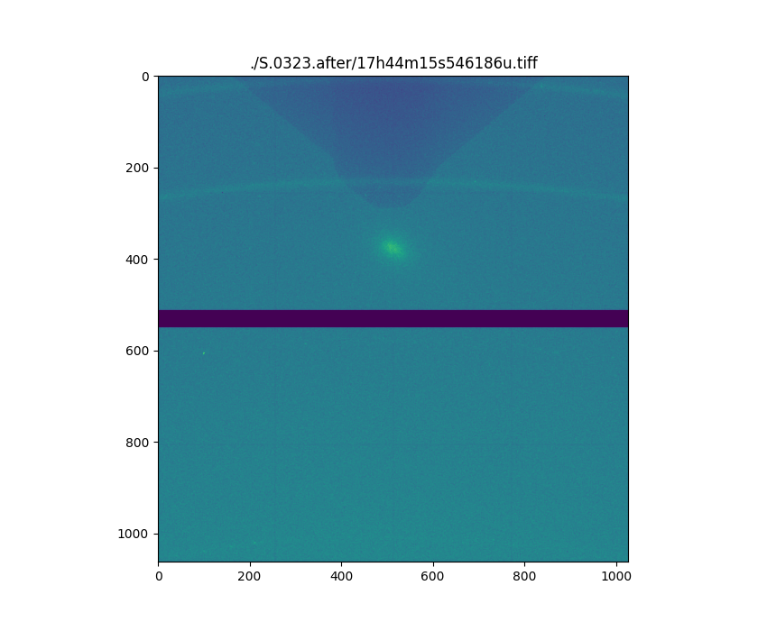

# Diffraction Experiment Procedure

## Primary Motors of the Diffractometer



Motor Range list 

    tth : -5˚ ~ 90˚
    th  : -5˚ ~ 40˚
    chi : -95˚ ~ 5˚
    phi : 0˚ ~ 360˚

### tth

<iframe width="560" height="315" src="https://www.youtube.com/embed/YPcGaWuBPEo?si=SWH8kVj4XxKCaBeM" title="YouTube video player" frameborder="0" allow="accelerometer; autoplay; clipboard-write; encrypted-media; gyroscope; picture-in-picture; web-share" referrerpolicy="strict-origin-when-cross-origin" allowfullscreen></iframe>

    Range : -5˚ ~ 90˚

### th

<iframe width="560" height="315" src="https://www.youtube.com/embed/tuBwzK4GwLM?si=dEaGIzA8rI0q6S9T" title="YouTube video player" frameborder="0" allow="accelerometer; autoplay; clipboard-write; encrypted-media; gyroscope; picture-in-picture; web-share" referrerpolicy="strict-origin-when-cross-origin" allowfullscreen></iframe>

    Range : -5˚ ~ 40˚

### chi

<iframe width="560" height="315" src="https://www.youtube.com/embed/vu5SkSc4_yU?si=GEuijC5e8cyDQvLk" title="YouTube video player" frameborder="0" allow="accelerometer; autoplay; clipboard-write; encrypted-media; gyroscope; picture-in-picture; web-share" referrerpolicy="strict-origin-when-cross-origin" allowfullscreen></iframe>

    Range : -95˚ ~ 5˚

### phi

<iframe width="560" height="315" src="https://www.youtube.com/embed/bjRUqMlDoEU?si=efxusyFvwJViggKp" title="YouTube video player" frameborder="0" allow="accelerometer; autoplay; clipboard-write; encrypted-media; gyroscope; picture-in-picture; web-share" referrerpolicy="strict-origin-when-cross-origin" allowfullscreen></iframe>

    Range : 0˚ ~ 360˚


## In-House Diffractometer




## Additional Motors for Sample Alignment

### phiz (sample height)

<iframe width="560" height="315" src="https://www.youtube.com/embed/T0nGvwHTIqs?si=af9o6JZmzOGL-tvd" title="YouTube video player" frameborder="0" allow="accelerometer; autoplay; clipboard-write; encrypted-media; gyroscope; picture-in-picture; web-share" referrerpolicy="strict-origin-when-cross-origin" allowfullscreen></iframe>

### farcx & farcy (sample tilt)

<iframe width="560" height="315" src="https://www.youtube.com/embed/ZXQggy31Lbk?si=zFc_XkjYk2QHKdRm" title="YouTube video player" frameborder="0" allow="accelerometer; autoplay; clipboard-write; encrypted-media; gyroscope; picture-in-picture; web-share" referrerpolicy="strict-origin-when-cross-origin" allowfullscreen></iframe>


---
### Attenuator Control

As shown in the diagram, we create holes at specific positions on an aluminum disk, where a corresponding number of molybdenum or copper foils are placed. A stepper motor controls the rotation of the attenuator disk, allowing for the selection of a specified number of attenuation foils to be positioned in the path of the X-ray beam.


The motor that controls the rotation of the attenuator disk is named `attn`. User command `att` to adjust the number of molybdenum or copper foils in the X-ray beam path.


    > att 0     <----- use no attenuation foil
    > att 1     <----- use one molybdenum foil
    > att 2     <----- use two molybdenum foils

In addition, during scans with a large variation of diffraction intensity, we can use the attenuator automatic adjustment function. Below are the relevant command descriptions:


    Enable the automatic attenuation function
    > auto_attn_on

    Disable the automatic attenuation function
    > auto_attn_off

    Setting the Attenuator Factor for Specified Attenuatior (ex: set attenuator factor for one molybdenum foil)
    > attDisk 1 10.1

    > auto_attn_info      <---------- check the current automatic attenuation function settings
    ============================
    AUTO ATTN    : ENABLE    ---> Function ENABLE/DISABLE
    AUTO ATTN MAX:  10       ---> Maximum number of attenuation foils
    PROTECT PLUS :  0        ---> Minimum number of attenuation foils
    DET UPPER LIM:  30000    ---> When the intensity exceeds this value, add attenuator foils automatically
    DET LOWER LIM:  1000     ---> When the intensity lower this value, decrease attenuator foils automatically

系統內存有衰減片的數量和衰減倍率的對應表，可以使用下面的指令 `attDisk` 查看。

The system keeps a relative attenuator factor table of the attenuator foils. You can use the command `attDisk` to view this table.

    > attDisk                      <--------- Input Command
    FileName : ~/macros/attDiskRatio/10keV.Mo1.20240624
    Attn	Real Ratio	Relative Ratio
    --------------------------------------
    Attn[0]	1.000e+00	1.000
    Attn[1]	1.190e+01	11.898      ----> att 1's relative Factor
    Attn[2]	6.586e+01	5.535       ----> att 2's relative Factor
    Attn[3]	5.507e+02	8.362
    Attn[4]	4.125e+03	7.490
    Attn[5]	3.433e+04	8.323
    Attn[6]	2.831e+05	8.247
    Attn[7]	2.152e+06	7.601
    Attn[8]	1.870e+07	8.692
    Attn[9]	2.806e+08	15.000
    Attn[10]	2.806e+09	10.000
    Attn[11]	2.806e+10	10.000
    Attn[12]	2.806e+11	10.000
    Attn[13]	2.806e+12	10.000
    Attn[14]	2.806e+13	10.000
    Attn[15]	2.806e+14	10.000
    Attn[16]	2.806e+15	10.000
    Attn[17]	2.806e+16	10.000
    Attn[18]	2.806e+17	10.000
    Attn[19]	2.806e+18	10.000

In the attenuator factor table: 

The attenuator factor of `Attn[1]` is `11.898`, which means an attenuation that is `11.989` times greater than `Attn[0]` 。 

The attenuator factor of `Attn[0]` is `1`, which represents no attenuation (no attenuation foil are in place). 

<br><br>

---
#### Calibrating the Attenuator Factor

Usually, we need to calibrate the attenuation factor of the attenuator foils.

假設要量測 `Attn[6]` (第六片)的相對倍率(相對於上一片; 第五片 `Attn[5]`)。
實作上，我們會找到一個馬達位置在衰減片數為 6 的時候其繞射強度約在 1000 ~ 5000 cts/s 的位置:

Suppose we want to measure the relative attenuation factor of `Attn[6]` (the sixth foil) relative to the previous foil, `Attn[5]`.

In practice, we would find a motor position where the diffraction intensity is approximately 1000 to 5000 cts/s when using 6th attenuator:

    > att 6     <------------------- move 6th attenuator foil on the beam path
    ...         <---------  move motor to the position where the diffraction intensity is around 1000 ~ 5000 cts/s

    > ct        <---------  measure the diffraction intensity
    ----------------------> suppose the detector intensity is 4968 cts/s

    > att 5     <------------------- now move to 5th attenuator foil
    > ct       <---------  measure the diffraction intensity
    ----------------------> suppose the detector intensity is 50149 cts/s


Calculate the actual relative attenuation factor of `Attn[6]`:

    Relative attenuation factor of `Attn[6]` : 50149 / 4968 = 10.09
    > attDisk 6 10.09      <---------- set the actual relative attenuation factor of `Attn[6]`

Suggest to calibrate the attenuation factor of the attenuator foils near the diffraction point of the substrate.

**Attention Please**

If the detected light exceeds 250,000 cts/s, the intensity response will become nonlinear.

	•	If the detected light exceeds 1,000,000 cts/s, the detector will be “overwhelmed.”
	•	Abnormal behavior of an overwhelmed detector: it may read a background value even without illumination.
	•	Light exceeding 1,000,000 cts/s will result in an abnormal reading.
	•	The areas of the detector hit by such intense light may suffer permanent damage.

Common Situations Where the Detector is Overwhelmed:

	•	Measuring direct beams without sufficient attenuators.
	•	Measuring the diffraction peak of a substrate without sufficient attenuators.
	•	Rotating the crystal and detector, passing through a strong diffraction point without sufficient attenuation.


---


## Sample Preparation & Placement

### Sample Rod 


### Place the Sample

<iframe width="560" height="315" src="https://www.youtube.com/embed/rLIqrE-IX48?si=nbmlBtu8MMnhS8mK" title="YouTube video player" frameborder="0" allow="accelerometer; autoplay; clipboard-write; encrypted-media; gyroscope; picture-in-picture; web-share" referrerpolicy="strict-origin-when-cross-origin" allowfullscreen></iframe>


## How to put the Sample to the center of diffractometer

1. Measuring the Direct Beam Intensity


    use command umvr to move phiz motor to adjust the sample height,
    and ensure the sample does not block the direct beam.

    > umvr phiz -1 
    > ct


2. move `phiz` to block the direct beam to half intensity



    > umvr phiz 0.1
    > ct
    > umvr phiz -0.1
    > ct
    .... adjust phiz to block the direct beam to half intensity


3. scan `th`


    At this point, the sample surface is usually not parallel to the beam. 
    Therefore, adjust the th (theta) to maximize the diffraction intensity

    > dscan th -0.5 0.5 20 1
    > pic

    The `pic` command is used to move the motor to the max intensity position.
    Sometimes the misalignment is significant, so you may need to repeat this adjustment several times.


4. adjust `phiz` again


    Finally, perform a phiz scan again, with a range slightly larger than 1 mm,
    because the beam size is approximately 0.8 mm.

    > dscan phiz -0.5 0.5 50 1

    Then move to the position where the intensity is at half its maximum.

    > cen 

    The cen command automatically finds the midpoint intensity (via fitting algorithm) and moves the motor to that position,
    when it detects a scan profile that resembles a step function.


---

# thin-film sample

## find Surface Normal diffraction reflection

ex: Si (0 0 4) 

    Si (0 0 4) diffraction reflection D-space = 0.135 nm
    use energy 12keV X-ray, wavelength = 1.033 Anstrom
    using following formula, get tth ~ 44.7221˚.



    move tth to 44.7221˚, th to 22.3611˚, 

    > umv tth 44.7221 th 22.3611

    tune tth, th, chi to maximize the diffraction intensity. (use umvr and dscan to adjust)

---


## th, chi Motor Calibration

When the beamline staff complete the beamline alignment, the tth angle is calibrated. 
However, the th and chi angles need to be calibrated.

Following steps are using Si (100) substrate's (0 0 4) reflection to calibrate th and chi angles.

1. at phi = 0˚, tune `tth`, `th`, `chi` to find the maximum intensity of Si (0 0 4) diffraction reflection.

    Record the th and chi values at this time. Assume th_1, chi_1.

2. move phi to 180˚, tune `th`, `chi` (don't tune `tth`) to find the maximum intensity of Si (0 0 4) diffraction reflection.

    Record the th and chi values at this time. Assume th_2, chi_2.

3. Calibrating `th` and `chi`


```
    move th  to ( th_1 + th_2 ) / 2
    move chi to (chi_1 + chi_2) / 2

    > umv th (th_1+th_2)/2
    > umv chi (chi_1+chi_2)/2

    reset th to half of tth
    reset chi to -90

    > set th tth_value/2
    > set chi -90
```

Now the `th` and `chi` angles are calibrated. The read values of `th` and `chi` are correct.

At the following experiments, it is not recommended to use the `set` command to reset `tth`, `th`, and `chi` angles.

---


## Substrate Surface-Normal Axis Alignment (if th and chi are not calibrated)

If the `th` and `chi` angles are not calibrated, the four-circle alignment process will be more complicated.

Because it is necessary to calibrate `th` and `chi` at the same time, 
and use `farcx` and `facry` to correct the orientation of the sample.


1. at phi = 0˚, tune `tth`, `th`, `chi` to find the maximum intensity of Si (0 0 4) diffraction reflection.


```
    Record the th and chi values at this time. Assume th_1, chi_1.
```


2. move phi to 180˚, tune `th`, `chi` (don't tune `tth`) to find the maximum intensity of Si (0 0 4) diffraction reflection.

```
    Record the th and chi values at this time. Assume th_2, chi_2.
```

3. `farcy` orientation fix (phi should be 180˚)


```
    move th  to ( th_1 + th_2 ) / 2
    > umv th  (th_1+th_2)/2

    reset th to half of tth
    > set th tth_value/2

    tune farcy to maximize the Si (0 0 4) diffraction intensity.
    > dscan farcy -0.1 0.1 20 1
    > cen


    move chi to (chi_1 + chi_2) / 2
    > umv chi (chi_1+chi_2)/2

    reset chi to -90˚
    > set chi -90
```


4. move phi to 90˚ or 270˚, tune `th`, `chi` to find the maximum intensity of Si (0 0 4) diffraction reflection.


```
    At this moment, chi should be close to -90˚

    move th to tth/2
    > umv th tth_value/2

    tune farcx to maximize the Si (0 0 4) diffraction intensity.
    > dscan farcx -0.1 0.1 20 1
    > cen
```


---


## Substrate Crystal Surface-Normal Axis Alignment (if th and chi are calibrated)

1. at phi = 0˚, tune `tth`, `th`, `chi` to find the maximum intensity of Si (0 0 4) diffraction reflection.

2. use `farcy` to correct the orientation of the sample.

```
    move th to half value of tth
    > umv th tth_value/2

    tune farcy to maximize the Si (0 0 4) diffraction intensity.
    > dscan farcy -0.1 0.1 20 1
    > cen

    !!! ATTENTION !!! When phi = 0˚, 180˚ corresponds to the direction of farcy.
```

3. move phi to 90˚, tune `th`, `chi` to find the maximum intensity of Si (0 0 4) diffraction reflection.

```
    move th to half value of tth
    > umv th tth_value/2

    tune farcx to maximize the Si (0 0 4) diffraction intensity.
    > dscan farcx -0.1 0.1 20 1
    > cen

    !!ATTENTION!! When phi = 90˚, 270˚ corresponds to the direction of farcx.
```

此時可以順便設定 pa 系統的 or0
Now you can set the or0 of the pa system.


```
    > setlat 
    ... (input lattice constant a, b, c, alpha, beta, gamma)

    > or0 0 0 4
```


---


## X-ray Reflectivity (XRR) 

When performing X-ray Reflectivity (XRR) experiments, you need to find the critical angle of total reflection of the optical surface. Here is a simple method.

1. move tth to 2˚, th to 1˚.

```
    the ratio of tth and th is 2/1, 
    so the position of tth = 2˚, th = 1˚ or the following positions can be tried:

    2:1
    3:1.5
    4:2

    However, be careful that the angle is too low, which may receive direct light.
```

2. tune `th` and `chi` angles to find the position of the maximum reflection intensity.


```
    Ideally, after Substrate Crystal Surface-Normal Axis Alignment, 
    you can directly move down tth and th to find the position of the maximum reflection intensity.
    
    Ideally, optical surface and substrate crystal axis will be parallel.

    However, most substrates are somewhat miscut when they are shipped.
    The miscut angle is usually marked by the supplier.

    So after Crystal Surface-Normal Axis Alignment, the system will use the substrate crystal axis as the main axis.
    To find the reflection of the optical surface, you still need to fine-tune th and chi.
```


### if th and chi are not calibrated

Now you can reset th to 1˚ and chi to -90˚.

```
    > set th 1
    > set chi -90
```

And then, the th and chi angles are calibrated based on the optical surface normal (not crystal surface normal axis) as main axis.


### if th and chi are calibrated


Now the difference between th and 1˚ and chi and -90˚ is the miscut angle.

    miscut 
    ==============================
    abs( th  - 1     )
    abs( chi - (-90) )


So if you are only here to measure XRR, after putting the sample to the center of diffractometer process, you can directly find the position of the maximum reflection intensity without the alignment of substrate surface-normal axis.

---


## Reciprocal Space Function ( PA system)

FourC's reciprocal space function can be used to perform diffraction measurements based on reciprocal space.
For example, calculating the `(tth, th, chi, phi)` position corresponding to the crystal `(H, K, L)` diffraction plane,
performing scans based on the `(H, K, L)` space coordinate axis, and `H-K`, `K-L`, `H-L` reciprocal lattice space mesh scans.


Using the reciprocal space function of FourC requires the following prerequisites:

    1. set the lattice constant (command : setlat)
    2. find two non-parallel diffraction reflections and set them as the primary vector (or0, setor0) and the secondary vector (or1, setor1)
    3. set the specified diffraction mode (command : setmode)
    4. set the specified sector (command : setsector)


### 1. Setting Sample Lattice Constant 

In FourC operation interface(command line interface), input command `setlat`, and then input lattice constant.

    > setlat
    
    Enter real space lattice parameters:
     Lattice a (5.4)?                        <-- key-in lattice constant a (unit : Å) 
     Lattice b (5.4)?                        <-- key-in lattice constant b (unit : Å) 
     Lattice c (5.4)?                        <-- key-in lattice constant c (unit : Å) 
     Lattice alpha (90)?                     <-- key-in lattice alpha (unit : degree)
     Lattice beta (90)?                      <-- key-in lattice beta  (unit : degree)
     Lattice gamma (90)?                     <-- key-in lattice gamma (unit : degree)
    (UB recalculated from orientation reflections and lattice.)


### 2. Seting Two non-parallel reciprocal lattice vectors of the sample 

In FourC operation interface, use the command `or0` to set the primary reciprocal lattice vector.

    > or0 H K L

    Suppose the current position is at the Si (0 0 4) diffraction reflection. 
    Then set the primary reciprocal lattice vector to (0 0 4) :
    > or0 0 0 4

In FourC operation interface, use the command `or1` to set the secondary reciprocal lattice vector.

    > or1 H K L

    Suppose the current position is at the Si (1 1 1) diffraction reflection. 
    Then set the secondary reciprocal lattice vector to (1 1 1) :
    > or1 1 1 1

However, if you already know these two reciprocal lattice vectors' motor position, you can use the following commands to set them directly.

    > setor0
    > setor1

Set the primary reciprocal lattice vector:

    > setor0
    Enter primary-reflection angles:
     Two Theta (0)?   <------------------ key-in tth value, ex: 44.9885
     Theta (0)?       <------------------ key-in th  value,  ex: 22.4940
     Chi (0)?         <------------------ key-in chi value, ex: -90
     Phi (0)?         <------------------ key-in phi value, ex: 0
    
    Enter primary-reflection HKL coordinates:
     H (0)?  <----------------------- key-in H index value, ex: 0
     K (0)?  <----------------------- key-in K index value, ex: 0 
     L (0)?  <----------------------- key-in L index value, ex: 4
    (UB recalculated from orientation reflections and lattice.)


Set the secondary reciprocal lattice vector:

    > setor1
    Enter primary-reflection angles:
     Two Theta (0)?   <--------------- key-in tth value, ex: 19.072
     Theta (0)?       <--------------- key-in th  value, ex: 9.536
     Chi (0)?         <--------------- key-in chi value, ex: -35.264
     Phi (0)?         <--------------- key-in phi value, ex: 9.9
    
    Enter primary-reflection HKL coordinates:
     H (0)?  <------------------ key-in H index value, ex: 1
     K (0)?  <------------------ key-in K index value, ex: 1 
     L (0)?  <------------------ key-in L index value, ex: 1
    (UB recalculated from orientation reflections and lattice.)


### 3. Set the specified diffraction mode

In FourC operation interface, use the command `setmode` to set the specified 
diffraction mode. The system provides the following 8 diffraction modes.


```
    > setmode
    Choose a four-circle geometry mode:

    0 Omega equals zero        <------ Commonly used mode : keep tth/th = 2/1
    1 Omega fixed
    2 Zone (Chi and Phi fixed)
    3 Phi fixed (Three-circle) <-- Commonly used mode : fix phi at specific angle
    4 Azimuth fixed
    5 Alpha fixed
    6 Beta fixed
    7 Theta fixed
    
    Your choice (0)?  <------ key-in choice，ex: 0 for Omega equals zero mode
```


Usually use `0 Omega equals zero` diffraction mode. In this mode, the ratio of `tth/th` is fixed at `2/1`.

Mode `3 Phi fixed (Three-circle)` will fix the angle of `phi`. Then adjust `th` and `chi` to meet the diffraction condition.
When using this mode, use the `freeze` command to set the angle of `phi`, 
and then use the `unfreeze` command to release the fixed angle when switching to other modes.

Suppose we want to fix phi = 45˚, use the following commands:

```
    > setmode 3
    > freeze 45
```

If you want to return to the normal mode(mode 0), use the following commands:

```
    > setmode 0
    > unfreeze
```

Usually when using the reciprocal space function, the mode selection is as follows:

    If you are in the off-normal and in-plane diffraction zone, use mode 0.

    If you are in the surface-normal diffraction zone, use mode 4 to fix phi, otherwise phi will run around.


### 4. Set the specified sector


While calculating the motor positions of (H, K, L) in the off-normal and in-plane diffraction zone,
if there is no motor range limitation, there will be multiple solutions.
Hence it is necessary to specify the sector to calculate the solution.

In the hardware design of TPS09A, only two sectors can be selected: 0 and 4.

If you find that the chi angle exceeds the range when calculating (H, K, L), 
you need to switch to another diffraction sector.

Suppose we use the `ca` command to calculate the motor position of (0 1 1).

```
    1693.FOURC> ca 0 1 1
    
    Calculated Positions:
    
    H K L =  0  0.99999  1
    Alpha = 7.774  Beta = 7.774  Azimuth = 89.999
    Omega = 0  Lambda = 1.033
    
    Two Theta     Theta       Chi       Phi
      15.5480    7.7740 -135.0000  135.0000          --------> -135˚ chi exceeds range : (-95˚~5˚)
    
    1694.FOURC>
```


Now you need to switch the sector.


```
    1694.FOURC> setsector         <------ command for setting sector
    
    Geometry sector (4)? 0        <------  it was 4, but now key-in 0
    Now using no sector transformations.
    
    1695.FOURC> ca 0 1 1          <------ calculate once again 
    
    Calculated Positions:
    
    H K L =  0  0.99999  1
    Alpha = 7.774  Beta = 7.774  Azimuth = -90.001
    Omega = 0  Lambda = 1.033
    
    Two Theta     Theta       Chi       Phi
      15.5480    7.7740  -45.0000  -45.0000    ------> Now the chi is in range, the phi will shift 
    
    1696.FOURC>
```

    
### 5. Finally, confirm all settings

Command `pa` can list the current reciprocal space settings.

    > pa
        
    Four-Circle Geometry, Phi fixed (Three-circle) (mode 3)  --> Confirm the mode
    Frozen values:  Phi = 45
    Sector 0           ----------------------------------------> Confirm the sector
    
      Primary Reflection (at lambda 1.033):
              tth th chi phi = 44.9885 22.494 -90 0   ---------> Confirm primary reflection
                       H K L = 0 0 4
    
      Secondary Reflection (at lambda 1.033):
              tth th chi phi = 19.072 9.536 -35.264 0  --------> Confirm secondary reflection
                       H K L = 1 1 1
    
      Lattice Constants (lengths / angles):
                  real space = 5.4 5.4 5.4 / 90 90 90  --------> Confirm the lattice constant
            reciprocal space = 1.164 1.164 1.164 / 90 90 90
    
      Azimuthal Reference:
                       H K L = 0 1 1
    
                      Lambda = 1.033         ------------------> Confirm the wavelength
    
     Cut Points:
          tth   th  chi  phi
         -180 -180 -180 -180


#### After all settings are completed

Execute the `wh` command, and the (H, K, L) position displayed will be correct.

    1706.FOURC> wh
    
    H K L =  1  0  0.99999  ----------> the (H K L) calculated from the (tth, th, chi, phi) position
    Alpha = 50.196  Beta = -39.27  Azimuth = 144.74
    Omega = 0  Lambda = 1.033
    
    Two Theta     Theta       Chi       Phi
      15.5480    7.7740  -45.0000   45.0000
    

---

## Use reciprocal space function

Use FourC to move and measure in the (H, K, L) space, be sure to use `ca` to verify first.

For example, the motor is currently at the position of (1 0 1).

    1705.FOURC> wh
    
    H K L =  1  0  0.99999
    Alpha = 50.196  Beta = -39.27  Azimuth = 144.74
    Omega = 0  Lambda = 1.033
    
    Two Theta     Theta       Chi       Phi
      15.5480    7.7740  -45.0000   45.0000

If you want to perform an `hscan` at the current position, first verify the start and end points.

    1733.FOURC> ca H K L      <---- calculate current position
    
    Calculated Positions:
    
    H K L =  1  0  0.99999
    Alpha = 50.196  Beta = -39.27  Azimuth = 144.74
    Omega = 0  Lambda = 1.033
    
    Two Theta     Theta       Chi       Phi
      15.5480    7.7740  -45.0000   45.0000
    
    1734.FOURC> ca H-0.1 K L    <------------- calculate the start point of hscan
    
    Calculated Positions:
    
    H K L =  0.89998  5.5616e-06  0.99998
    Alpha = 50.252  Beta = -39.316  Azimuth = 146.22
    Omega = 0  Lambda = 1.033
    
    Two Theta     Theta       Chi       Phi
      14.7865    7.3930  -48.0130   45.0000   <-- make sure these motor positions are in range
    
    1735.FOURC> ca H+0.1 K L   <------------- calculate the end point of hscan
    
    Calculated Positions:
    
    H K L =  1.1  3.0851e-07  0.99997
    Alpha = 50.135  Beta = -39.219  Azimuth = 143.5
    Omega = 0  Lambda = 1.033
    
    Two Theta     Theta       Chi       Phi
      16.3490    8.1745  -42.2735   45.0000   <-- make sure these motor positions are in range


After confirming that there are no problems, start the scan:

```
    1736.FOURC> hscan H-0.1 H+0.1 40 1
```

ATTENTION : 

    (H, K, L) space coordinates entered for movement are always ‘absolute positions.’

    After a scan in (H, K, L) space, the system remains at the final position and does not return to the pre-scan position.

    The H, K, and L variables are system variables represents the current (H, K, L) position.
    , and updated after each scan and motor movement.


## XRR

The first step of XRR experiment is to find the critical angle of total reflection of the optical surface.

1. move tth to 2˚, th to 1˚.

    > umv tth 2 th 1

2. tune `th` and `chi` angles to find the position of the maximum reflection intensity.


```
    after fine-tuning th and chi, calculating the miscut 
    ------------------------------
    miscut_th  = th  - 1
    miscut_chi = chi - (-90)
```


If **the sample crystal surface-normal axis has been aligned** or **the motor calibration** of th and chi has been done, 
it is not recommended to reset th and chi at this time. 

To do the XRR scanning without resetting the th and chi, 
you can add the **miscut value** of `th` to fix the `th`, as shown in the following command:

    att 7
    auto_attn_on
    ascan tth  0  1    th    0+miscut_th 0.5+miscut_th  100  1
    ascan tth  1  5    th  0.5+miscut_th 2.5+miscut_th  100  1
    auto_attn_off
    att 7

The above series of commands is an example of an XRR scan. You can directly write these commands into a macro file, 
and then use the `do` command to execute it. Assuming the file name is `xrr.mac`, the execution command is as follows:

    > do xrr.mac

<br>
<br>
<br>
<br>

----

# Cryostat Command 


After the cryostat function is enabled, two temperature sensors will be used. During each `ct` or `scan`, 
their readings will be displayed as `TempA` and `TempB`.


    ....
           C400A = 0 (0/s)
         cnt_att = 8 (8/s)
           count = 0 (0/s)
           TempA = 299.92 (299.92/s)   -----> TempA : cryostat main Sensor temperature ("K" unit)
           TempB = 298.1 (298.1/s)     -----> TempB : cryostat secondary Sensor temperature ("K" unit)
    ....


enable cryostat function

    > ther_switch 1

disable cryostat function

    > ther_switch 0

set target temperature (unit `K`)

    > ther_set_temp 10

show cryostat status

    > ther_info


<br>
<br>
<br>
<br>

----

# DCS500 Command

During each `ct` or `scan`, its reading will be displayed as `TempA`. (unit `˚C`)

`TempB` is no use

enable DCS500 function

    > ther_switch 2

enable DCS500 function

    > ther_switch 0

set target temperature (unit `˚C`)

    > ther_set_temp 100

set ramp rate (unit `˚C/min`)

    > ther_set_ramp 5

show DCS500 status

    > ther_info


    1987.FOURC> ct
    
    Sun Aug 04 09:29:22 2024
    
          Second = 1
         Monitor = 0 (0/s)
        Detector = 0 (0/s)
             IC1 = 122 (122/s)
             IC2 = 870 (870/s)
             IC3 = 0 (0/s)
           Igate = 0 (0/s)
           GAP_A = 25 (25/s)
         CURRENT = 0 (0/s)
          c400_t = 0 (0/s)
             IC5 = 0 (0/s)
           C400B = 0 (0/s)
           C400A = 0 (0/s)
         cnt_att = 8 (8/s)
           count = 0 (0/s)
           TempA = 30 (30/s) ---------> TempA : DCS500 main Sensor temperature (˚C unit)
           TempB = 30 (30/s)


<br>
<br>
<br>
<br>

----

# EIGER Command

Attention when using EIGER:

    1. The EIGER’s ROI 1, 2, 3, and 4 correspond to the detectors PIL200k, PIL200kR2, PIL200kR3, and PIL200kR4, respectively.
    2. The EIGER pixel size is 75 µm x 75 µm.
    3. The intensity reading for each EIGER pixel should not exceed 60,000 counts
    4. Pay attentation on Attenuator
    5. You need to shift tth for +25˚ to switch from point detector to EIGER detector
    6. You need to shift tth for -25˚ to switch from EIGER detector to point detector

enable EIGER function

    > eiger_enable

disable EIGER function

    > eiger_disable

show EIGER status

    > eiger_info
    ------------------ Eiger Info ---------------------
      FourC Connect : DISABLE
    -- Subsystem --
      File Writer   : Enable
      Stream        : Enable
      Monitor       : Disable
    ------------------ ROI 1 ---------------------
      X   : start [0] , size[1028]
      Y   : start [0] , size[1062]
    ------------------ ROI 2 ---------------------
      X   : start [300] , size[500]
      Y   : start [50] , size[500]
    ------------------ ROI 3 ---------------------
      X   : start [100] , size[300]
      Y   : start [100] , size[400]
    ------------------ ROI 4 ---------------------
      X   : start [200] , size[200]
      Y   : start [200] , size[200]
    ----------------------------------------------


The following image is an EIGER image data, the intensity is taken in log scale and using color map "viridis".




    1984.FOURC> ct
    
    Sun Aug 04 09:27:38 2024
    
          Second = 1
         Monitor = 0 (0/s)
        Detector = 0 (0/s)
             IC1 = 116 (116/s)
             IC2 = 865 (865/s)
             IC3 = 0 (0/s)
             APD = 0 (0/s)
           Igate = 0 (0/s)
         SCREEN2 = 0 (0/s)
           GAP_A = 25 (25/s)
          c400_t = 0 (0/s)
           C400B = 0 (0/s)
          c400_3 = 0 (0/s)
          c400_4 = 0 (0/s)
           C400A = 0 (0/s)
         PIL200k = 0 (0/s)  ---------> EIGER ROI 1
       PIL200kR2 = 0 (0/s)  ---------> EIGER ROI 2
       PIL200kR3 = 0 (0/s)  ---------> EIGER ROI 3
       PIL200kR4 = 0 (0/s)  ---------> EIGER ROI 4
         cnt_att = 8 (8/s)
           count = 0 (0/s)
           TempA = 299.92 (299.92/s)
           TempB = 298.1 (298.1/s)

